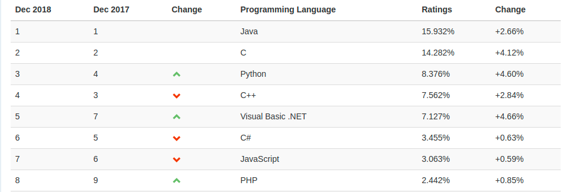
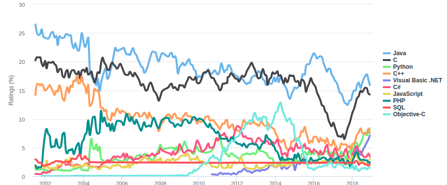
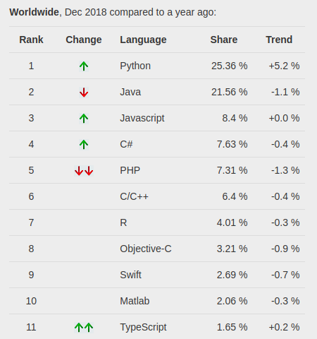
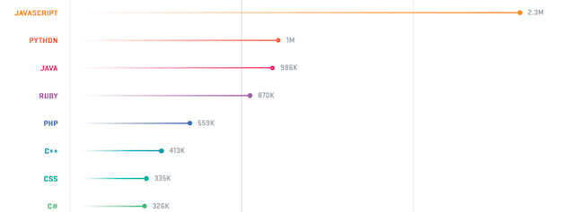
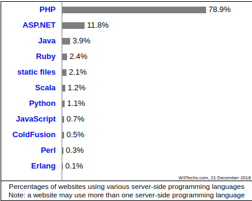

class: center, middle

# Is Java Dead?

---

# Disclaimer

Кожна мова програмування була створена для виконання певної задачі. Якщо існувала якась інша мова, яка могла б також виконати цю потребу, то ніхто не піде на всю неприємність створення 
абсолютно нової мови програмування.

Що це означає, що (загалом) кожна існуюча мова, яка не є абсолютно застарілою, є "найкращою" для вирішення певних задач.

---

# TIOBE community index

**TIOBE індекс** (рейтинг мов програмування) — показник популярності мов програмування. Розраховується виходячи з кількості результів запитів до пошукових систем, що містять назву мови.

---

# TIOBE community index

---

# PYPL

The PYPL PopularitY of Programming Language Index is created by analyzing how often language tutorials are searched on Google.

---

# GitHub

Here are the most popular programming languages used at Github:

---

# W3tech

This diagram shows the percentages of websites using various server-side programming languages. [w3tech](https://w3techs.com/technologies/overview/programming_language/all)

---

# Where Java Good At

- Large scale enterprise application
    - Sun targeted Java to speak to the needs of enterprises early on. It pushes standards that promote vendor independance at every level. Platform independant, database independant, application server independant, etc.
    - Java has good long-term support. Has libaries for everising.
- Android development

---

# Java Problems

- The main issue with java is the multitude of competeing framworks, all trying to get you to write your stuff their way.
- Generally Java (via the JVM) is known for its speed, stability, and a huge field of competent candidates. The common advise is still to write your startup in a language that lets you go far fast, then retool for performance (perhaps including Java) if you happen to go big.
- Java for Android. (Has competiong language, like, Kotlin)
- Java updates too slow(new Oracle release model mb will fix this)

---

# You might using java even if you dont write on it

- **Apache Cassandra** — вільна та відкрита розподілена з широким стовпчиком noSQL система керування базами даних, яка створена для роботи з високомасштабованими і надійними сховищами величезних масивів даних. 
- **Apache ZooKeeper** is essentially a centralized service for distributed systems to a hierarchical key-value store, which is used to provide a distributed configuration service, synchronization service, and naming registry for large distributed systems.
- **Apache Kafka** - розподілений програмний брокер повідомлень, проект з відкритим вихідним кодом, що розробляється в рамках фонду Apache. Написаний на мові програмування Scala і Java.
- **Elasticsearch** — вільне програмне забезпечення, пошуковий сервер, розроблений на базі Lucene. Надає розподілений, мультиарендний повнотекстовий пошуковий рушій з HTTP веб-інтерфейсом і підтримкою безсхемних JSON документів.
- **Apache Hadoop** — вільна програмна платформа і каркас для організації розподіленого зберігання і обробки наборів великих даних з використанням моделі програмування MapReduce.

---

# Platforms

Linux and Windows Desktop or Server are the most common choices that our respondents say they have done development work for this year. According to [GitHub Servey](https://insights.stackoverflow.com/survey/2018/)

