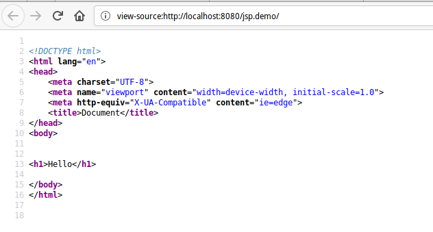

# JSP


## Що таке JSP?


### Що таке JSP?

- **Java Server Pages** представляє технологію, яка дозволяє створювати динамічні веб-сторінки. Спочатку JSP (разом з Сервлетами) на зорі розвитку Java EE були домінуючим підходом до веб-розробки на мові Java. І хоча в даний час вони поступилося своїм місцем іншій технології - JSF, проте JSP продовжують широко використовуватися.
- По суті Java Server Page або JSP є html-код з вкрапленнями коду Java. У той же час станиці jsp - це не стандартні html-сторінки. Коли приходить запит до певної сторінці JSP, то сервер обробляє її, генерує з неї код html і відправляє його клієнту. В результаті користувач після звернення до сторінці JSP бачить в своєму браузері звичайну html-сторінку.


### JSP копілюється в Servlet

- JSP транслюється в Java-сервлет і обробляє HTTP-запити і генерує відповіді як будь-який сервлет. Однак технологія JSP забезпечує більш зручний спосіб кодування сервлету.
- Сторінка JSP обслуговує запити, як сервлет. Отже, життєвий цикл і багато можливостей сторінок JSP (зокрема, динамічні аспекти) визначаються технологією Java Servlet.
- JSP-файл компілюються або при першому зверненні до нього, або при старті сервера. Це залежить від налаштувань сервера. Крім того, скомпільовані class-файли можуть зберігатися не в каталозі проекту, а в кеші сервера, тому ви можете їх не виявити навіть після звернення до jsp-сторінці.


## Основи синтаксису JSP


### Основи синтаксису JSP
Вміст сторінки JSP фактично ділиться на код html (а також css / javascript) і код на мові java. Для вставки коду Java на сторінку JSP можна використовувати п'ять основних елементів:
- Вирази JSP (JSP Expression)
- Скріплет JSP (JSP Scriplet)
- Оголошення JSP (JSP Declaration)
- Директиви JSP (JSP Directive)
- Коментарі JSP


### JSP Expression
Код, поміщений у тег вираження JSP, записується у вихідний потік відповіді. Так що вам не потрібно писати out.print () для запису даних. В основному це використовується для друку значень змінної або методу.


### JSP Expression
Синтаксис Jsp виразів

```jsp
<%=  statement %>
```


### JSP Expression
Наприклад,
```jsp
<%= "This is string" %>

<!-- a is variable -->
<%= a %>
```


### JSP Scriplet
Скриплет JSP дають можливість вставити будь-який код в метод сервлета, який буде створений при обробці сторінки, дозволяючи використовувати більшість конструкцій Java. Скріплет також мають доступ до тих же заздалегідь певним змінним, що і вирази. Тому, наприклад, для виведення значення на сторінку необхідно використовувати заздалегідь певну змінну out.


### JSP Scriplet
Синтаксис JSP Скриплетів:

```jsp
<% 
    for(int i = 0; i < 10; i++)
	    out.print(i);
%>
```


### JSP Declaration
Тег декларації JSP використовується для оголошення полів та методів. Код, написаний всередині тегу дессенції jsp, розміщується поза службою () методом автоматично створеного сервлета. Таким чином, він не виділяє пам'яті за кожним запитом.


### JSP Declaration
Синтаксис JSP Declaration:
```jsp
<%! %>
```


### JSP Declaration
Приклад:

```jsp
<%!
int testVar = 3;
%>

<%!
int getTestVar(){
	return testVar;
}
%>

<%= "Test var = " + testVar %>
<%= "Result of getTestVar() = " + getTestVar() %>
```


### JSP Directive
**Директиви** забезпечують глобальну інформацію, що стосуються конкретних запитів, які направляються в JSP, а також надавати інформацію, необхідну на стадії трансляції.

 Директиви завжди поміщаються на початку JSP-сторінки до всіх інших тегів, щоб parser (аналізатор) JSP при розборі тексту на самому початку виділив глобальні інструкції. Таким, чином, JSP Engine (середа виконання JSP), аналізуючи код, створює з JSP сервлет. Директиви є повідомлення контейнеру JSP.


### JSP Directive
Синтаксис директив JSP виглядає наступним чином:

 ```xml
 <%@ директива ім'яАтрибута="значення" %>
 ```

Директива може мати кілька атрибутів. В цьому випадку директива може бути повторена для кожного з атрибутів. У той же час пари "імяАтрибута = значення" можуть розташовуватися під однією директивою з пропуском як роздільник.


### JSP Directive
Існує три типи директив:
- page (сторінка)
- taglib (бібліотека тегів)
- include (включити)


### JSP Directive
**Директива page** визначає параметри сторінки JSP, які впливають на транслятор. Порядок проходження атрибутів у директиві page не має значення. Порушення синтаксису або наявність нерозпізнаних атрибутів призводить до помилки трансляції. Прикладом директиви page може служити наступний код:

```xml
<%@ page buffer="none" isThreadSafe="yes" errorPage="/error.jsp" %>
```


### JSP Directive
Список можливих атрибутів директиви page дивитися в workbook


### Директива taglib
Директива taglib оголошує, що дана сторінка JSP використовує бібліотеку тегів, унікальним чином ідентифікуючи її за допомогою URI, і ставить у відповідність префікс тега, за допомогою якого можливі дії в бібліотеці. Якщо контейнер не може знайти бібліотеку тегів, виникає фатальна помилка трансляції.

Директива taglib має наступний синтаксис:

```xml
<%@ Taglib uri = "URI включається бібліотеки тегів" prefix = "імяПрефікса"%>
```


### Директива include
Директива include дозволяє вставляти текст або код в процесі трансляції сторінки JSP в сервлет. Синтаксис директиви include має наступний вигляд:

```xml
<%@ Include file = "Відносний URI включається сторінки"%>
```


### Директива include
Контейнер JSP отримує доступ до файлу, що включається. Якщо файл, який включається змінився, контейнер може перекомпілювати сторінку JSP. Директива include розглядає ресурс, наприклад, сторінку JSP, як статичний об'єкт.


### Директива include
**header.jsp**:
```xml
&lt;!DOCTYPE html&gt;
&lt;html lang=&quot;en&quot;&gt;
&lt;head&gt;
    &lt;meta charset=&quot;UTF-8&quot;&gt;
    &lt;meta name=&quot;viewport&quot; content=&quot;width=device-width, initial-scale=1.0&quot;&gt;
    &lt;meta http-equiv=&quot;X-UA-Compatible&quot; content=&quot;ie=edge&quot;&gt;
    &lt;title&gt;Document&lt;/title&gt;
&lt;/head&gt;
&lt;body&gt;
```

**footer.jsp**:
```xml
&lt;/body&gt;
&lt;/html&gt;
```


### Директива include
**index.jsp**:
```html
<%@ include file="header.jsp" %>
<h1>Hello</h1>
<%@ include file="footer.jsp" %>
```


### Директива include



### JSP Comment
У JSP-файлі є кілька способів прокоментувати.

1.
```xml
<%-- comment --%>
```

Коментар JSP. Ігнорується движком JSP. Чи не відображається на клієнтському комп'ютері (вихідний код браузера).


### JSP Comment
```xml
<! - comment ->
```

Коментар HTML. Ігнорується браузером. Він відображається в клієнтській машині (вихідний код браузера) в якості коментаря.


### JSP Comment
3. 
```xml
<% my code //my comment %>
```

Коментар до окремому рядку Java. Ігнорується компілятором. Чи не відображається на клієнтському комп'ютері (вихідний код браузера).


### JSP Comment
4.
```xml
<% my code /**
         my comment  **/  
       %>
```
Коментар Java Multi line. Ігнорується компілятором. Чи не відображається на клієнтському комп'ютері (вихідний код браузера).


## Заздалегідь визначенні змінні


### Заздалегідь визначенні змінні
Для спрощення коду у виразах JSP і скріплет, надано набір автоматично визначенних змінних, іноді званих неявними об'єктами.


### request
Це об'єкт HttpServletRequest, пов'язаний із запитом, який дозволяє вам звертатися до параметрів запиту (через метод getParameter), типу запиту (GET, POST, HEAD, і т.д ..), і тим, хто HTTP заголовках (cookies, Referer, і т. д ..). Простіше кажучи, request є підкласом ServletRequest і може відрізнятися від HttpServletRequest якщо використовується протокол відмінний від HTTP, що на практиці практично ніколи не зустрічається.


### response
Це об'єкт типу HttpServletResponse, пов'язаний з відповіддю на запит клієнта. Зверніть увагу що, оскільки потік виводу (див. Out далі) буферизованного, можна змінювати коди стану HTTP і заголовки відповідей, навіть якщо це неприпустимо в звичайному Сервлет, але лише в тому випадку якщо якісь дані виведення вже були відправлені клієнту.


### out
Це об'єкт типу PrintWriter, який використовується для відправки виведення клієнту. Однак, щоб зробити об'єкт response (див. Попередній розділ) корисним, слід використовувати буферізірованний варіант PrintWriter - JspWriter. Пам'ятайте що ви можете змінювати розмір буфера і навіть відключити буферизацію, змінюючи значення атрибуту buffer директиви page. Це питання детально розглянуто в Розділі 5. Також зверніть увагу що out використовується практично виключно скріплет, оскільки вираження JSP автоматично розміщуються в потік виводу, що позбавляє від необхідності явного звернення до out.


### session
Це об'єкт типу HttpSession, пов'язаний із запитом. Сесії створюються автоматично, і ця змінна існує навіть якщо немає посилань на вхідні сесії. Єдиним винятком є ​​ситуація, коли ви відключаєте використання сесій використовуючи атрибут session директиви page (див. Розділ 5). У цьому випадку посилання на змінну session призводять до виникнення помилок при трансляції JSP сторінки в сервлет.


