# JDBC

# Зміст

${toc}

# JDBC. Що і навіщо?

**Java DataBase Connectivity** (англ. Java DataBase Connectivity — з'єднання з базами даних на Java), скорочено JDBC) — прикладний програмний інтерфейс Java, який визначає методи, з допомогою яких програмне забезпечення на Java здійснює доступ до бази даних. JDBC — це платформо-незалежний промисловий стандарт взаємодії Java-застосунків з різноманітними СУБД, реалізований у вигляді пакета java.sql, що входить до складу Java SE.

Переваги JDBC:
- Легкість розробки: розробник може не знати специфіки бази даних, з якою працює;
- Код не змінюється, якщо компанія переходить на іншу базу даних;
- Не треба встановлювати громіздку клієнтську програму;
- До будь-якої бази можна під'єднатись через легко описуваний URL.

JDBC включає в себе API для:
- З'єднання із базою даних
- Створення SQL запитів
- Виконання SQL запитів
- API транзакцій і збережених процедур

# JDBC. Концепція драйверів.

В основі JDBC лежить концепція так званих драйверів, що дозволяють отримувати з'єднання з базою даних по спеціально описаному URL. Драйвери можуть завантажуватись динамічно (під час роботи програми). Завантажившись, драйвер сам реєструє себе й викликається автоматично, коли програма вимагає URL, що містить протокол, за який драйвер «відповідає».

Нижче наведено архітектурну діаграму, яка показує розташування менеджера драйверів щодо драйверів JDBC та програми Java


У всіх прикладах підключення до бази даних в Інтернеті ви обов'язково зустрінете ці рядки:

```java
Class.forName(driverClass);
Connection connection = DriverManager
        .getConnection(url, user, password);
```

Де driverClass - це рядок з повним ім'ям класу JDBC драйвера, наприклад org.h2.Driver для H2 Database або com.mysql.jdbc.Driver для MySql.

Всі основні сутності в JDBC API, з якими вам доведеться працювати, є інтерфейсами:

- Connection;
- Statement;
- PreparedStatement;
- CallableStatement;
- ResultSet;
- Driver;
- DatabaseMetaData.

JDBC драйвер конкретної бази даних як раз і надає реалізації цих інтерфейсів.

DriverManager - це Сінглтон, який містить інформацію про всіх зареєстрованих драйвери. Метод getConnection на підставі параметра URL знаходить java.sql.Driver відповідної бази даних і викликає у нього метод connect.

Так а навіщо ж виклик Class.forName ()?

Якщо подивитися джерельний код реалізації будь-якого драйвера він буде містити статичний блок ініціалізації такого виду:

```java
static {
    try {
        java.sql.DriverManager.registerDriver(new Driver());
    } catch (SQLException e) {
        throw new RuntimeException("Can't register driver!");
    }
}
```

Виклик Class.forName завантажує клас і цим гарантує виконання статичного блоку ініціалізації, а значить і реєстрацію драйвера в DriverManager.

# Основні JDBC компоненти.

Основні компоненти JDBC:
- DriverManager.
- Driver.
- Connection.
- Statement.
- ResultSet.
- SQLEXception.

## DriverManager

Клас DriverManager є рівнем управління в JDBC і знаходиться між користувачем і драйверами. Він відстежує всі доступні драйвери і управляє встановленням з'єднань між БД і відповідним драйвером. До того ж, клас DriverManager піклується про такі речі, як максимальний час логіна до БД і висновок налагоджувальної інформації в журнал.

Для простих додатків єдиний корисний метод в цьому класі - це DriverManager.getConnection. Як можна здогадатися по його імені, він встановлює з'єднання з БД. JDBC дозволяє користувачеві викликати також наступні методи DriverManager: getDriver, getDrivers і registerDriver, і метод connect інтерфейсу Driver, але в більшості випадків краще перекласти відповідальність встановлення з'єднання на клас DriverManager.

## Driver

Цей інтерфейс обробляє зв'язок із сервером бази даних. Ви будете взаємодіяти безпосередньо з об'єктами Driver дуже рідко. Замість цього ви використовуєте об'єкти DriverManager, які керують об'єктами цього типу.

## Connection

Об'єкт Connection являє собою контекст зв'язку, тобто весь зв'язок із базою даних здійснюється лише через об'єкт з'єднання.

## Statement

Об'єкти, створені з цього інтерфейсу, використовуються для надсилання SQL-запитів до бази даних. Деякі похідні інтерфейси приймають параметри, крім виконання збережених процедур.

## ResultSet

Об'єкти ResultSet зберігають дані, отримані з бази даних після того, як ви виконуєте SQL-запит за допомогою об'єктів Statement. Він діє як ітератор, який дозволяє вам переміщатися за своїми даними.

## SQLException
Цей клас обробляє будь-які помилки, що виникають у додатку до бази даних.
SQLException є checked винятком і його всюди треба тягнути або обертати в try catch.

# Використання JDBC
## Налаштування середовища

JDBC API знаходиться в Java SE, а це означає, що для роботи з ним нам не потрібно завнтажувати якісь бібліотеки, що не можна сказати про чамих постачальників драйверів.

В залежності від того з якою базою даних ми працюємо потрібно завантажити відповідний jar - файл, або додати залежність, якщо використовується система сборки, на постачальника драйверів.

Наприклад, скачати jar - файл драйвера можна за посиланнями:
- MySQL – http://dev.mysql.com/downloads/connector/j/
- PostqreSLQ – http://jdbc.postgresql.org/download.html
- Oracle – http://www.oracle.com/technetwork/database/features/jdbc/index-091264.html

## Створення з'єднання із базою даних

### Підключення до Mysql

```java
Class.forName("com.mysql.jdbc.Driver");
Connection conn = DriverManager.getConnection("jdbc:mysql://hostname:port/dbname","username", "password");
conn.close();
```

### Підключення до PostgreSQL

```java
Class.forName("org.postgresql.Driver");
Connection connection = DriverManager.getConnection("jdbc:postgresql://hostname:port/dbname","username", "password");
connection.close();
```

### Підключення до Oracle

```java
Class.forName("oracle.jdbc.driver.OracleDriver");
Connection connection = DriverManager.getConnection("jdbc:oracle:thin:@localhost:1521:mkyong","username","password");
connection.close();
```

### 

## Виконання запитів

# Патерн DAO, використовуючи JDBC

## Створення нового проекту

Відкрийте Eclipse IDE і створіть новий Maven - проект:

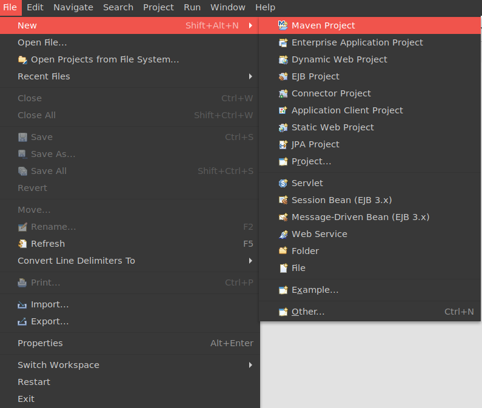

Встановіть галочку напроти Create a simple project(skip archetype selection)

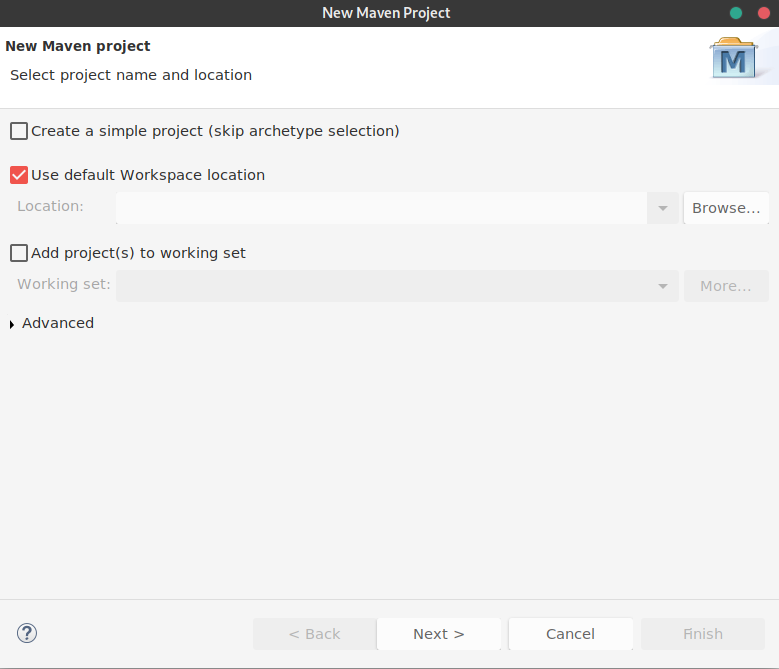

Встановіть Group Id і Artifact Id
- Group Id відноситься до організації в, якій ми працюємо
- Artifact Id - назва  проекту всередині організації

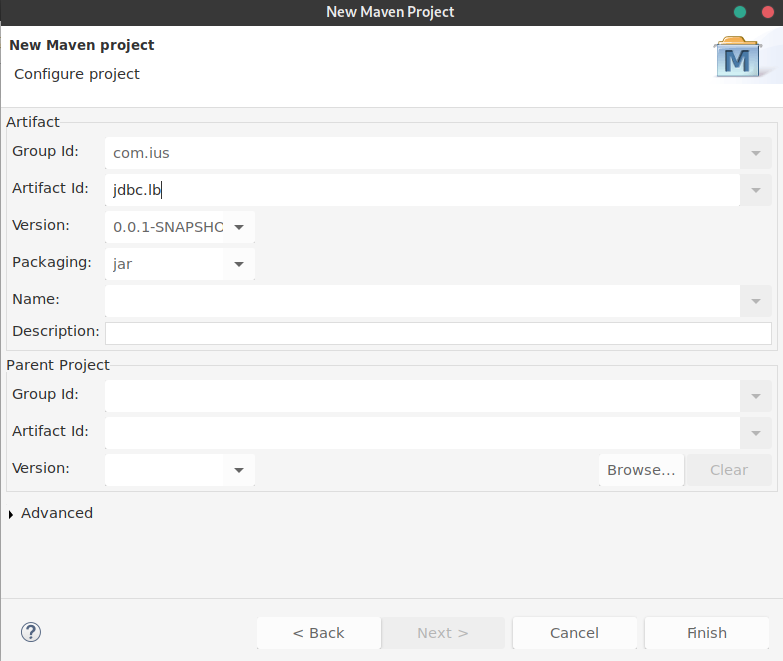

В результаті ми отримаємо наступну структуру проекта в Eclipse

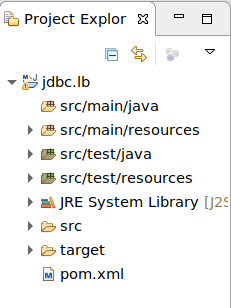

- src/main/java - містить Java - класи
- pom.xml - файл maven, який містить деталі зборки проекту

Інші елементи в структурі проекту нас покищо не цікавлять.

Натисніть правою кнопкою мишки на проекті і виберіть New -> File

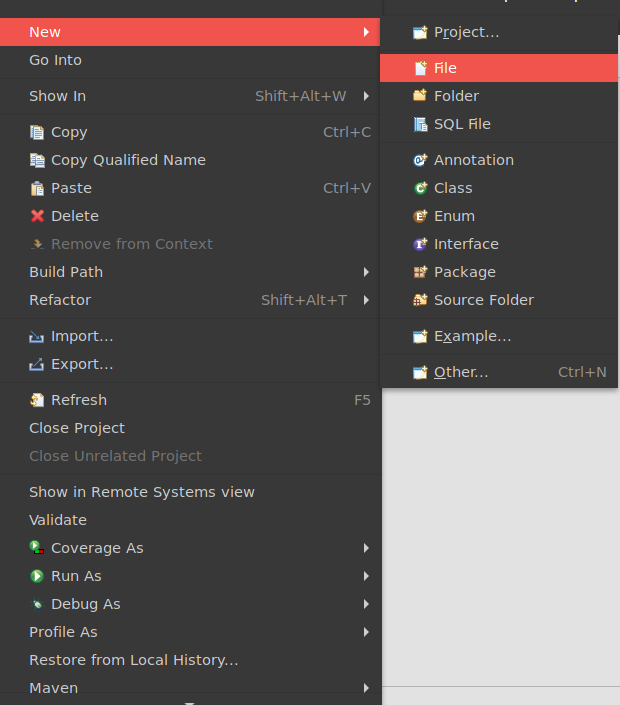

Потрібно створити новий файл db.db, який буде представляти собою sqlite - файл бази даних.

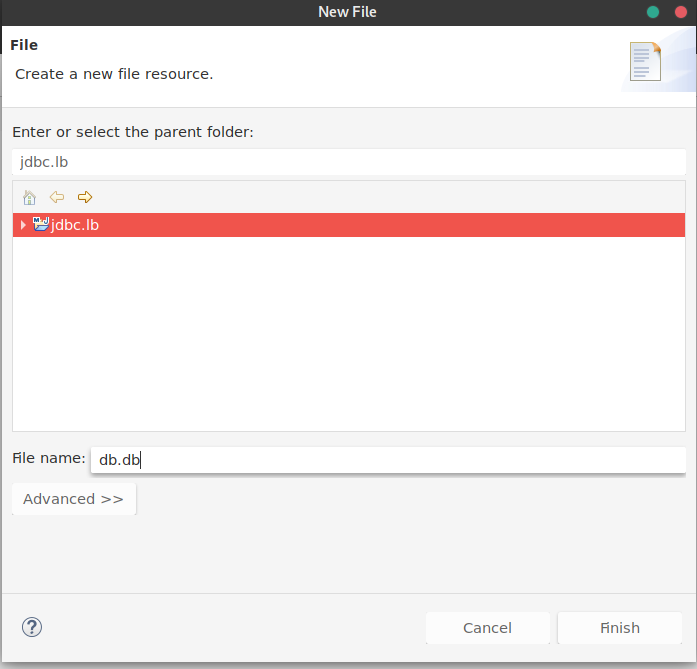

## Додавання залежності постачальника драйверів для роботи з sqlite

Відкрийте pom.xml і додайте наступну залежність:

```xml
<dependency>
    <groupId>org.xerial</groupId>
    <artifactId>sqlite-jdbc</artifactId>
    <version>3.25.2</version>
</dependency>
```

Після цього pom.xml виглядає так:

```xml
<project xmlns="http://maven.apache.org/POM/4.0.0"
	xmlns:xsi="http://www.w3.org/2001/XMLSchema-instance"
	xsi:schemaLocation="http://maven.apache.org/POM/4.0.0 http://maven.apache.org/xsd/maven-4.0.0.xsd">
	<modelVersion>4.0.0</modelVersion>
	<groupId>com.ius</groupId>
	<artifactId>jdbc.lb</artifactId>
	<version>0.0.1-SNAPSHOT</version>

	<dependencies>
		<dependency>
			<groupId>org.xerial</groupId>
			<artifactId>sqlite-jdbc</artifactId>
			<version>3.25.2</version>
		</dependency>
	</dependencies>
</project>
```

## Створення доменої моделі

Створіть новий клас Product.

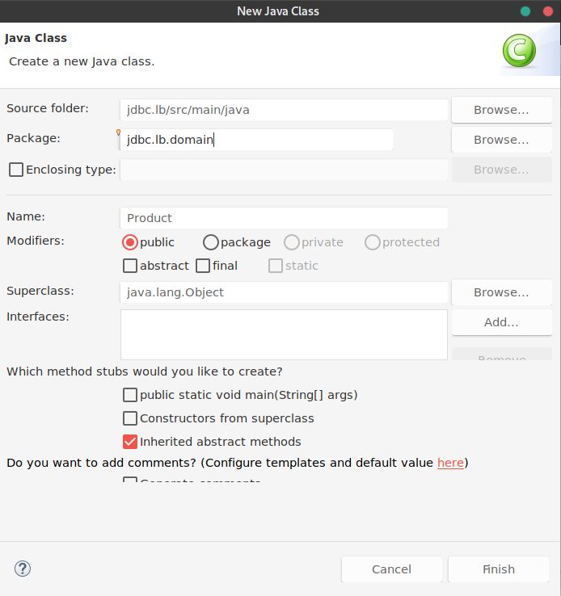

Вміст Product.java наступний:

```java
package jdbc.lb.domain;

public class Product {
	int id;
	
	public int getId() {
		return id;
	}

	public void setId(int id) {
		this.id = id;
	}

	String title;
	
	public Product(int id, String title, float price) {
		super();
		this.id = id;
		this.title = title;
		this.price = price;
	}

	float price;
	
	public String getTitle() {
		return title;
	}
	
	public void setTitle(String title) {
		this.title = title;
	}
	
	public Product() {}
	
	public float getPrice() {
		return price;
	}
	
	public Product(String title, float price) {
		this.title = title;
		this.price = price;
	}
	
	public void setPrice(float price) {
		this.price = price;
	}

	@Override
	public String toString() {
		return "Product [id=" + id + ", title=" + title + ", price=" + price + "]";
	}
}
```

## Створення слоя доступу до даних - DAO

Створіть новий інтерфейс - ProductDAO:

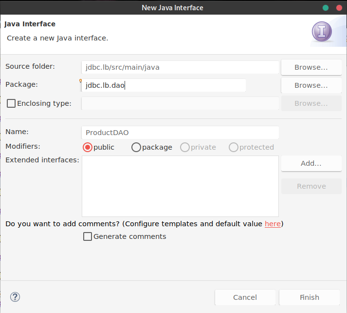

Файл ProductDAO.java має наступний вміст:

```java
package jdbc.lb.dao;

import java.util.List;

import jdbc.lb.domain.Product;

public interface ProductDAO {
	List<Product> getAll();
	Product getById(int id);
	Product add(Product product);
	void remove(Product product);
	void update(Product product);
}
```

Створіть новий клас ProductDAOImpl, який реалізує ProductDAO:

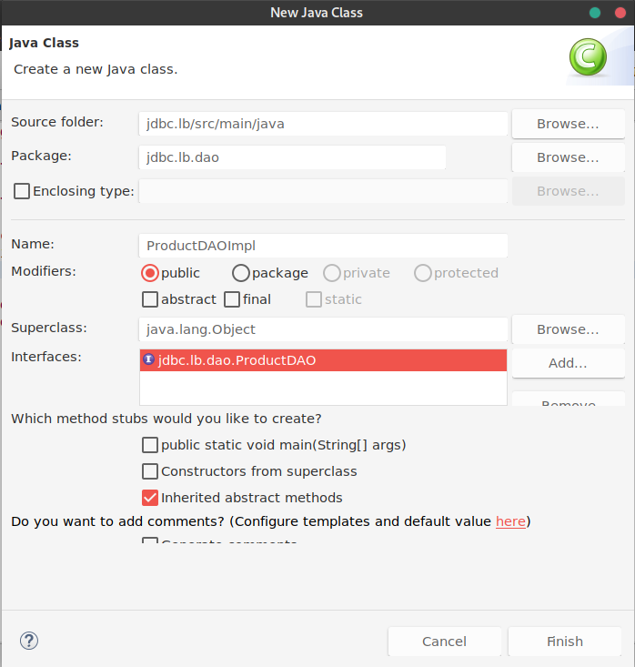

Покищо ProductDAOImpl містить лише заглушки для реалізації інтерфейсу ProductDAO:

```java
package jdbc.lb.dao;

import java.util.List;

import jdbc.lb.domain.Product;

public class ProductDAOImpl implements ProductDAO {

	public List<Product> getAll() {
		// TODO Auto-generated method stub
		return null;
	}

	public Product getById(int id) {
		// TODO Auto-generated method stub
		return null;
	}

	public Product add(Product product) {
		// TODO Auto-generated method stub
		return null;
	}

	public void remove(Product product) {
		// TODO Auto-generated method stub
	}

	public void update(Product product) {
		// TODO Auto-generated method stub
	}
}
```

## Реалізація getAll

```java
public List<Product> getAll() {
		Connection connection = null;
		List<Product> products = null;

		try {
			connection = DriverManager.getConnection("jdbc:sqlite:db.db");
			String sql = "SELECT * FROM PRODUCTS;";
			Statement statement = connection.createStatement();
			ResultSet productsResult = statement.executeQuery(sql);
			products = new ArrayList<Product>();
			while (productsResult.next()) {
				Product product = new Product();
				product.setId(productsResult.getInt(1));
				product.setTitle(productsResult.getString(2));
				product.setPrice(productsResult.getFloat(3));
				products.add(product);
			}
		} catch (SQLException e) {
			e.printStackTrace();
		} finally {
			if (connection != null)
				try {
					connection.close();
				} catch (SQLException e) {
					e.printStackTrace();
				}
		}
		return products;
	}
```

## Реалізація getById

```java
public Product getById(int id) {
		Connection connection = null;

		try {
			connection = DriverManager.getConnection("jdbc:sqlite:db.db");
			String sql = "SELECT * FROM PRODUCTS where id = ?;";
			PreparedStatement preparedStatement = connection.prepareStatement(sql);
			preparedStatement.setInt(1, id);
			ResultSet productsResult = preparedStatement.executeQuery();
			while (productsResult.next()) {
				Product product = new Product();
				product.setId(productsResult.getInt(1));
				product.setTitle(productsResult.getString(2));
				product.setPrice(productsResult.getFloat(3));
				return product;
			}
		} catch (SQLException e) {
			e.printStackTrace();
		} finally {
			if (connection != null)
				try {
					connection.close();
				} catch (SQLException e) {
					e.printStackTrace();
				}
		}
		return null;
	}
```

## Реалізація add

```java
	public Product add(Product product) {
		Connection connection = null;

		try {
			connection = DriverManager.getConnection("jdbc:sqlite:db.db");
			String sql = "INSERT INTO PRODUCTS(title, price) VALUES(?,?);";
			PreparedStatement preparedStatement = connection.prepareStatement(sql);
			preparedStatement.setString(1, product.getTitle());
			preparedStatement.setFloat(2, product.getPrice());
			preparedStatement.executeUpdate();
		} catch (SQLException e) {
			e.printStackTrace();
		} finally {
			if (connection != null)
				try {
					connection.close();
				} catch (SQLException e) {
					e.printStackTrace();
				}
		}
		return product;
	}
```

## Реалізація remove

```java
public void remove(Product product) {
		Connection connection = null;

		try {
			connection = DriverManager.getConnection("jdbc:sqlite:db.db");
			String sql = "DELETE FROM PRODUCTS WHERE id = ?;";
			PreparedStatement preparedStatement = connection.prepareStatement(sql);
			preparedStatement.setInt(1, product.getId());
			preparedStatement.executeUpdate();
		} catch (SQLException e) {
			e.printStackTrace();
		} finally {
			if (connection != null)
				try {
					connection.close();
				} catch (SQLException e) {
					e.printStackTrace();
				}
		}
	}
```

## Реалізація update

```java
public void update(Product product) {
		Connection connection = null;

		try {
			connection = DriverManager.getConnection("jdbc:sqlite:db.db");
			String sql = "UPDATE PRODUCTS SET title = ?, price = ? WHERE id = ?;";
			PreparedStatement preparedStatement = connection.prepareStatement(sql);
			preparedStatement.setString(1, product.getTitle());
			preparedStatement.setFloat(2, product.getPrice());
			preparedStatement.setInt(3, product.getId());
			preparedStatement.executeUpdate();
		} catch (SQLException e) {
			e.printStackTrace();
		} finally {
			if (connection != null)
				try {
					connection.close();
				} catch (SQLException e) {
					e.printStackTrace();
				}
		}
	}
```

## Створення конструктора для ініціалізації бази даних sqlite

Ми додамо в клас ProductDAOImpl конструктор, який буде створювати таблицю в базі даних, якщо вона ще не була створена. Код конструктора приведено нижче:

```java
public ProductDAOImpl() {
		Connection connection = null;

		try {
			connection = DriverManager.getConnection("jdbc:sqlite:db.db");
			String sql = "CREATE TABLE IF NOT EXISTS PRODUCTS(id INTEGER PRIMARY KEY AUTOINCREMENT, title STRING, price FLOAT);";
			Statement statement = connection.createStatement();
			statement.executeUpdate(sql);
		} catch (SQLException e) {
			e.printStackTrace();
		} finally {
			if (connection != null)
				try {
					connection.close();
				} catch (SQLException e) {
					e.printStackTrace();
				}
		}
	}
```

## Остаточний код ProductDAOImpl.java

```java
package jdbc.lb.dao;

import java.sql.Connection;
import java.sql.DriverManager;
import java.sql.PreparedStatement;
import java.sql.ResultSet;
import java.sql.SQLException;
import java.sql.Statement;
import java.util.ArrayList;
import java.util.List;

import jdbc.lb.domain.Product;

public class ProductDAOImpl implements ProductDAO {

	public ProductDAOImpl() {
		Connection connection = null;

		try {
			connection = DriverManager.getConnection("jdbc:sqlite:db.db");
			String sql = "CREATE TABLE IF NOT EXISTS PRODUCTS(id INTEGER PRIMARY KEY AUTOINCREMENT, title STRING, price FLOAT);";
			Statement statement = connection.createStatement();
			statement.executeUpdate(sql);
		} catch (SQLException e) {
			e.printStackTrace();
		} finally {
			if (connection != null)
				try {
					connection.close();
				} catch (SQLException e) {
					e.printStackTrace();
				}
		}
	}

	public List<Product> getAll() {
		Connection connection = null;
		List<Product> products = null;

		try {
			connection = DriverManager.getConnection("jdbc:sqlite:db.db");
			String sql = "SELECT * FROM PRODUCTS;";
			Statement statement = connection.createStatement();
			ResultSet productsResult = statement.executeQuery(sql);
			products = new ArrayList<Product>();
			while (productsResult.next()) {
				Product product = new Product();
				product.setId(productsResult.getInt(1));
				product.setTitle(productsResult.getString(2));
				product.setPrice(productsResult.getFloat(3));
				products.add(product);
			}
		} catch (SQLException e) {
			e.printStackTrace();
		} finally {
			if (connection != null)
				try {
					connection.close();
				} catch (SQLException e) {
					e.printStackTrace();
				}
		}
		return products;
	}

	public Product getById(int id) {
		Connection connection = null;

		try {
			connection = DriverManager.getConnection("jdbc:sqlite:db.db");
			String sql = "SELECT * FROM PRODUCTS where id = ?;";
			PreparedStatement preparedStatement = connection.prepareStatement(sql);
			preparedStatement.setInt(1, id);
			ResultSet productsResult = preparedStatement.executeQuery();
			while (productsResult.next()) {
				Product product = new Product();
				product.setId(productsResult.getInt(1));
				product.setTitle(productsResult.getString(2));
				product.setPrice(productsResult.getFloat(3));
				return product;
			}
		} catch (SQLException e) {
			e.printStackTrace();
		} finally {
			if (connection != null)
				try {
					connection.close();
				} catch (SQLException e) {
					e.printStackTrace();
				}
		}
		return null;
	}

	public Product add(Product product) {
		Connection connection = null;

		try {
			connection = DriverManager.getConnection("jdbc:sqlite:db.db");
			String sql = "INSERT INTO PRODUCTS(title, price) VALUES(?,?);";
			PreparedStatement preparedStatement = connection.prepareStatement(sql);
			preparedStatement.setString(1, product.getTitle());
			preparedStatement.setFloat(2, product.getPrice());
			preparedStatement.executeUpdate();
		} catch (SQLException e) {
			e.printStackTrace();
		} finally {
			if (connection != null)
				try {
					connection.close();
				} catch (SQLException e) {
					e.printStackTrace();
				}
		}
		return product;
	}

	public void remove(Product product) {
		Connection connection = null;

		try {
			connection = DriverManager.getConnection("jdbc:sqlite:db.db");
			String sql = "DELETE FROM PRODUCTS WHERE id = ?;";
			PreparedStatement preparedStatement = connection.prepareStatement(sql);
			preparedStatement.setInt(1, product.getId());
			preparedStatement.executeUpdate();
		} catch (SQLException e) {
			e.printStackTrace();
		} finally {
			if (connection != null)
				try {
					connection.close();
				} catch (SQLException e) {
					e.printStackTrace();
				}
		}
	}

	public void update(Product product) {
		Connection connection = null;

		try {
			connection = DriverManager.getConnection("jdbc:sqlite:db.db");
			String sql = "UPDATE PRODUCTS SET title = ?, price = ? WHERE id = ?;";
			PreparedStatement preparedStatement = connection.prepareStatement(sql);
			preparedStatement.setString(1, product.getTitle());
			preparedStatement.setFloat(2, product.getPrice());
			preparedStatement.setInt(3, product.getId());
			preparedStatement.executeUpdate();
		} catch (SQLException e) {
			e.printStackTrace();
		} finally {
			if (connection != null)
				try {
					connection.close();
				} catch (SQLException e) {
					e.printStackTrace();
				}
		}
	}

}
```

## Тестування ProductDAOImpl

Створіть новий клас із методом public static void main:

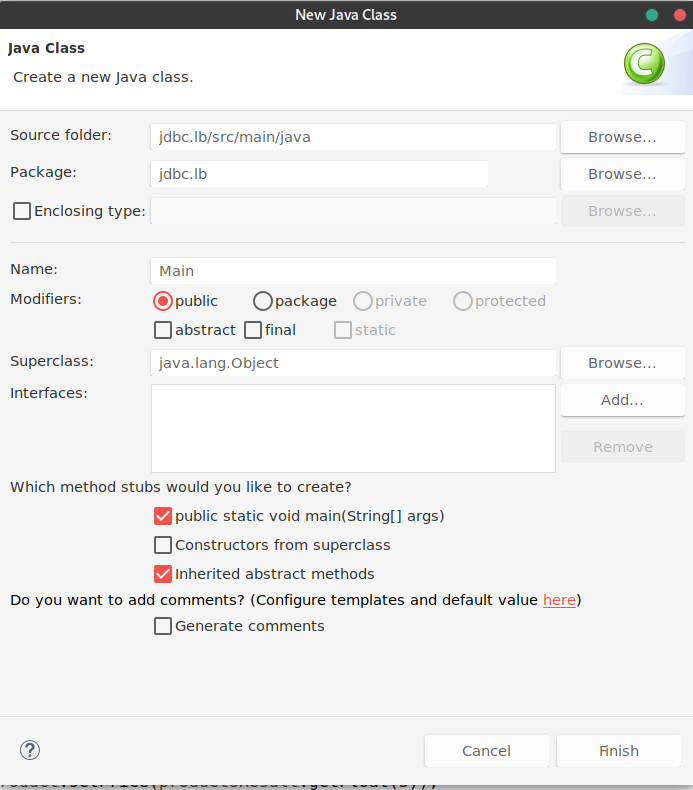

Код класа Main:

```java
package jdbc.lb;

import jdbc.lb.dao.ProductDAO;
import jdbc.lb.dao.ProductDAOImpl;
import jdbc.lb.domain.Product;

public class Main {

	public static void main(String[] args) {
		ProductDAO productDAO = new ProductDAOImpl();
		productDAO.add(new Product("Boots", 20));
		productDAO.add(new Product("Iphone", 20));
		
		productDAO.getAll().stream()
			.forEach(System.out::println);
		
		Product product = productDAO.getById(1);
		product.setTitle("Modified Title");
		productDAO.update(product);
		
		productDAO.getAll().stream()
		.forEach(System.out::println);
	}

}
```

Результат виконання додатку:

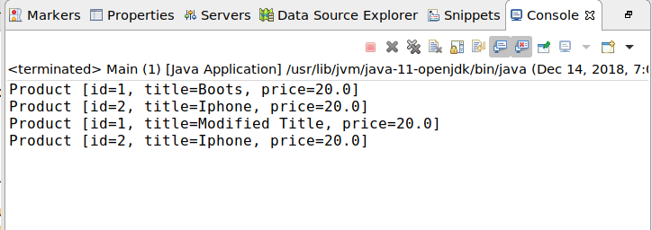

# Домашнє завдання

Реалізуйте шаблон DAO з використанням JDBC. Модель згідно із варіантом.

## Варіанти

### Варіант 1

```
Employee{
	id: Integer,
	name: String,
	age: Integer
}
```

### Варіант 2

```
Phone{
	id: Integer,
	brand: String,
	model: String
}
```

### Варіант 3

```
Todo{
	id: Integer,
	title: String,
	dueDate: String | Date
}
```

### Варіант 4

```
Post{
	id: Integer,
	title: String,
	author: String
}
```

### Варіант 5

```
Book{
	id: Integer,
	title: String,
	ISBN: String
}
```

### Варіант 6

```
Car{
	id: Integer,
	brand: String,
	model: String
}
```

### Варіант 7

```
Article{
	id: Integer,
	title: String,
	text: String
}
```

### Варіант 8

```
OS{
	id: Integer,
	title: String,
	platform: String
}
```

### Варіант 9

```
Application{
	id: Integer,
	title: String,
	license: String
}
```

### Варіант 10

```
Song{
	id: Integer,
	title: String,
	artist: String
}
```

# Контрольні запитання

1. Що таке JDBC? Назвіть основні компоненти JDBC.
2. Поясніть концепцію постачальників драйверів.
3. Яка різниця між Statement і PreparedStatement?
4. Яка різниця між executeQuery() і executeUpdate()?