# Servlets API

**Java Servlet API** — стандартизований API для створення динамічного контенту до веб-сервера, використовуючи платформу Java. Сервлети — аналог технологій PHP, CGI і ASP.NET.

У двох словах описати роботу сервлету можна так: Web-сервер, який вміє працювати з сервлетами, запускає Java-машину, яка в свою чергу виконує сервлет, а сервлет віддає дані, які він сформує. Тобто при приході запиту від клієнта сервер за допомогою спеціального конфігураційного файлу може визначити, який сервлет виконати, сервлет виконується і створює HTML-сторінку, яку сервер відправляє клієнту.

# Web Container

Контейнер сервлетів - програма, що представляє собою сервер, який займається системною підтримкою сервлетов і забезпечує їх життєвий цикл відповідно до правил, певними в специфікаціях. Може працювати як повноцінний самостійний веб-сервер, бути постачальником сторінок для іншого веб-сервера, наприклад Apache, або інтегруватися в Java EE сервер додатків. Забезпечує обмін даними між сервлетом і клієнтами, бере на себе виконання таких функцій, як створення програмного середовища для функціонуючого сервлету, ідентифікацію та авторизацію клієнтів, організацію сесії для кожного з них.

Сервер по суті є контейнером, який завантажує сервлети, виконує їх, викликаючи певні методи і отримавши від них результат, відправляє його клієнту.


# Основа сервлета

Архітектура API сервлета грунтується на тому, що класичний провайдер сервісу використовує метод service (), через який всі клієнтські запити будуть надсилатися програмним забезпеченням контейнера сервлетів, і методи життєвого циклу init () і destroy (), які викликаються тільки в той час, коли сервлет завантажується і вивантажується (це трапляється рідко).

```java
public interface Servlet {
   public void init(ServletConfig config) throws ServletException;
   
   public ServletConfig getServletConfig();
   
   public void service(ServletRequest req, ServletResponse res)
         throws ServletException, IOException;
   
   public String getServletInfo();
   
   public void destroy();
}
```

Основне призначення getServletConfig () полягає в поверненні об'єкта ServletConfig, який містить параметри ініціалізації і запуску для цього сервлета. getServletInfo () повертає рядок, що містить інформацію про Сервлет, таку, як автор, версія і авторські права.

Клас GenericServlet є оболочечной реалізацією цього інтерфейсу і зазвичай не використовується. Клас HttpServlet є розширенням GenericServlet і спеціально призначений для обробки HTTP протоколу - HttpServelt є одним з тих класів, які ви будете використовувати найчастіше.

Найбільше зручність атрибутів сервлетного API полягає у зовнішніх об'єктах, які вводяться разом з класом HttpServlet для його підтримки. Якщо ви взглянене на метод service () в інтерфейсі Servlet, ви побачите, що він має два параметри: ServeltRequest і ServletResponse. Разом з класом HttpServlet, ці два об'єкти призначені для HTTP: HttpServletRequest і HttpServletResponse.

# Servlet - клас

Сервлет - це Java-клас, який успадковується зазвичай від класу • HttpServlet і перевизначає частину методів:
- doGet - якщо ми хочемо, щоб сервлет реагував на GET запит.
- doPost - якщо ми хочемо, щоб сервлет реагував на POST запит.
- doPut, doDelete - якщо ми хочемо, щоб сервлет реагував на PUT і DELETE запит (є і такі в HTTP). Ці методи реалізуються вкрай рідко, тому що самі команди теж дуже рідко зустрічаються.
- init, destroy - для управління ресурсами в момент створення сервлету і в момент його знищення.

Якщо ж необхідно перехоплювати всі команди, то простіше перевизначити метод service. Саме цей метод викликається при приході запиту від клієнта. У HttpServlet відбувається розбір запиту і у відповідності з вказаною командою викликається метод doGet, doPost і т.д.

# Життєвий цикл сервлета

Життєвий цикл будь-якого сервлета складається з 4 етапів:
- Ініціалізація, яка відбувається при виклику методу init ()
- Обробка клієнтського запиту після виклику методу service ()
- Знищення сервлету за допомогою виклику методу destroy ()
- Повне знищення сервлету (Garbage Collector).

Схематично, життєвий цикл сервлета можна представити таким чином:
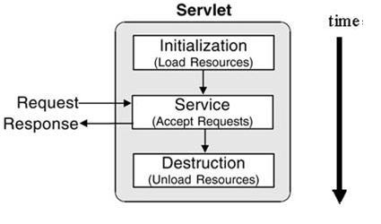

Після отримання запиту, для обробки якого необхідний певний сервлет, відбувається його ініціалізація (метод init ()). Після цього, відбувається обробка даного запиту (service ()). І, в кінці життєвого циклу сервлету відбувається виклик методу destroy ().


## Метод init()

Даний метод викликається тільки один раз при створенні сервлету.

Зазвичай, створення відбувається в момент переходу за посиланням (URL) на сторінку, роботу якої забезпечує певний сервлет. Це може бути змінено - і створення може відбуватися при запуску сервера.

Після створення сервлету, кожен запит від клієнта призводить до створення нового потоку, який працює з методами doGet або doPost - в залежності від самого запиту.

## Метод service()

Даний метод є основним методом, який і містить саму логіку роботи сервлета. Він викликається для обробки отриманого запиту і передачі відповіді HTTP клієнту.

При отриманні запиту, сервер створює новий потік, який викликає метод service. Даний метод перевіряє тип запиту (POST, GET і т.д.) і викликає відповідний метод (doPost, doGet і т.д.)

## Метод destroy()

Даний метод викликається після того, як сервлет виконав свої завдання. Використовується, наприклад, для таких завдань, як запис даних в cookie, закриття з'єднання до бази даних (далі - БД) і т.д.


# HttpServlet, HttpServletRequest, HttpServletResponse

## HttpServlet

Пакети сервлетів включають два абстрактних класу, які реалізують інтерфейс Servlet: клас GenericServlet (з пакета javax.servlet) і клас HttpServlet (з пакета javax.servlet.http). Ці класи надають реалізацію за замовчуванням для всіх методів інтерфейсу Servlet. Більшість розробників використовують або клас GenericServlet, або клас HttpServlet, і заміщають деякі або всі методи.

Сервлети, що працюють з клієнтами через Web, зазвичай розширюють клас HttpServlet. Метод service, як правило, перевизначається, щоб мати можливість розрізняти стандартні методи запитів, одержувані від Web-браузера клієнта. Двома найбільш поширеними типами запитів HTTP (їх також називають методами запитів) є get і post. Запит get отримує (або витягує) інформацію. Запит post поміщає (або відправляє) дані на сервер. Типове застосування методу post - відправка на сервер інформації для аутентифікації, або даних з форми, в яку користувач ввів інформацію.

У класі HttpServlet визначені методи doGet і doPost для реакції на запити типу get і post клієнта. Ці методи викликаються методом service класу HttpServlet, який, в свою чергу, викликається при надходженні запиту на сервер. Метод service спочатку визначає тип запиту, а потім викликає відповідний метод. Є й інші, менш уживані типи запитів.

Методи doGet і doPost приймають в якості параметрів об'єкти HttpServletRequest і HttpServletResponse, які дають можливість здійснювати взаємодію між клієнтом і сервером. Методи інтерфейсу HttpServletRequest полегшують доступ до даних запиту. Методи інтерфейсу HttpServletResponse полегшують повернення результатів Web-клієнта у вигляді HTML.

## HttpServletRequest

При кожному виклику методи doGet і doPost класу HttpServlet приймають в якості параметра об'єкт, який реалізує інтерфейс HttpServletRequest. Web-сервер, який виконує сервлет, створює об'єкт HttpServletRequest і передає його методу service сервлета (який в свою чергу передає його методу doGet або doPost). Даний об'єкт містить запит, що надійшов від клієнта.

Є безліч методів, що дають можливість сервлету обробляти клієнтський запит. Деякі з цих методів належать інтерфейсу ServletRequest - інтерфейсу, який розширюється інтерфейсом HttpServletRequest. Ряд ключових методів, використаних в прикладах, представлені в таблиці. Повний список методів інтерфейсу HttpServletRequest можна знайти в документації компанії Oracle.

| Метод | Пояснення |
|-------|-----------|
|String getParameter(String name)|Отримання з запиту значення параметра. Найменування параметра визначено значенням name.|
|Enumeration getParameterNames()|Отримання з запиту імен всіх параметрів.|
String[ ] getParameterValues(String name)|Для параметра з декількома значеннями даний метод повертає строковий масив.|
Cookie[ ] getCookies ()|Отримання масиву об'єктів Cookie, збережених на комп'ютері клієнта. Cookie можуть бути використані для унікальної ідентифікації клієнта сервером.|
HttpSession getSession(boolean create)|Повертає об'єкт HttpSession поточного сеансу клієнта. Якщо параметр create дорівнює true і об'єкт HttpSession не існує, то створюється новий об'єкт HttpSession.|

## HttpServletResponse

При кожному зверненні до сервлету методи doGet і doPost класу HttpServlet приймають об'єкт, який реалізує інтерфейс HttpServletResponse. Web-сервер, виконуючий сервлет, створює об'єкт HttpServletResponse і передає його методу service сервлета (який в свою чергу передає його методу doGet або doPost). Інтерфейс HttpServletResponse визначає відповідь клієнту.

Є безліч методів інтерфейсу HttpServletResponse, що дають можливість сервлету сформувати відповідь клієнту. Деякі з цих методів належать інтерфейсу ServletResponse, який розширюється інтерфейсом HttpServletResponse. Ряд ключових методів представлені в таблиці. Повний список методів інтерфейсу HttpServletResponse можна знайти в документації.

| Метод | Пояснення |
|-------|-----------|
void addCookie (Cookie cookie)| Метод використовується для додавання Cookie в заголовок відповіді клієнта. Встановлений максимальний вік Cookie, а також дозвіл клієнтом зберігання Cookie визначають, чи будуть Cookies збережені на клієнті і час їх зберігання.|
|ServletOutputStream getOutputStream()|Отримання бінарного потоку виведення для відправлення бінарних даних клієнта.|
PrintWriter getWriter| Отримання символьного потоку виведення для відправлення текстових даних клієнта.|
void setContentType(String type)| Визначення MIME-типу відповіді браузеру. MIME-тип допомагає браузеру визначити, як відображати дані. Наприклад, MIME-тип "text / html" вказує, що відповідь є HTML-документом, тому браузер відображає HTML-сторінку.|


# Створення і виконання сревлетів в середовищі Eclipse з використанням Jetty Maven Plugin

## Створення webapp - проекту

В середовищі Eclipse створіть новий Maven Project. Виберіть archetype - maven-archytype-webapp

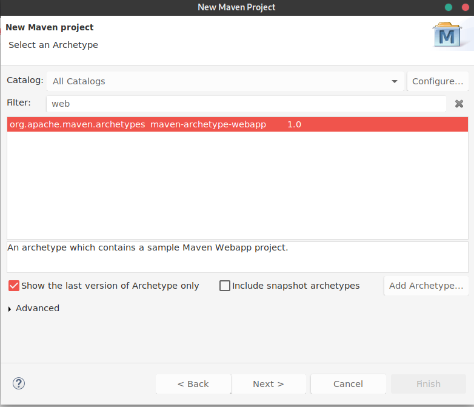

Заповніть необхідну інформацію для створення Maven проекту:

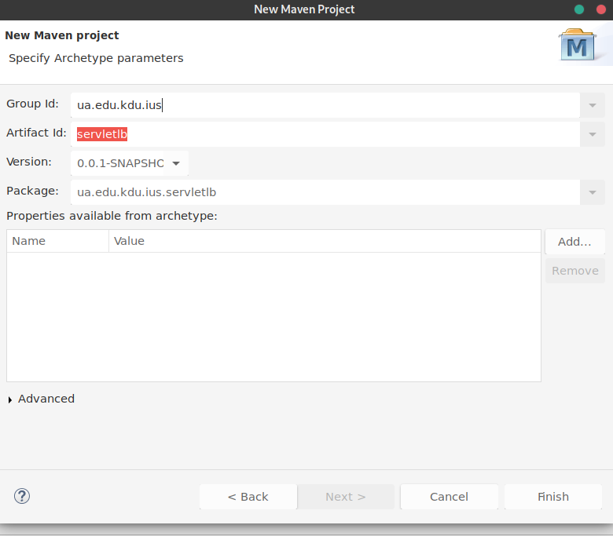

В результаті ми отримаємо наступну структуру проекту:

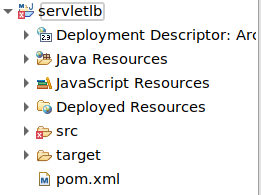

## Додавання Servlet API

Проект містить помилку, хочу ми не змінили жодного файлу, це зв'язано з тим, що 
webapp archetype містить шаблон JSP(про JSP, ми поговоримо пізніше), покищо можна сказати що це той же самий сервлет.

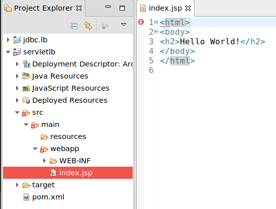

Оскільки сервлет - це API, яке не входить в поставку Java SE, нам потрібно додати залежність за допомогою Maven.

Відкрийте pom.xml і додайте наступну залежність:

```xml
<dependency>
    <groupId>javax.servlet</groupId>
    <artifactId>javax.servlet-api</artifactId>
    <version>4.0.1</version>
    <scope>provided</scope>
</dependency>
```

Після цього pom.xaml виглядає так:

```xml
<project xmlns="http://maven.apache.org/POM/4.0.0"
	xmlns:xsi="http://www.w3.org/2001/XMLSchema-instance"
	xsi:schemaLocation="http://maven.apache.org/POM/4.0.0 http://maven.apache.org/maven-v4_0_0.xsd">
	<modelVersion>4.0.0</modelVersion>
	<groupId>ua.edu.kdu.ius</groupId>
	<artifactId>servletlb</artifactId>
	<packaging>war</packaging>
	<version>0.0.1-SNAPSHOT</version>
	<name>servletlb Maven Webapp</name>
	<url>http://maven.apache.org</url>
	<dependencies>
		<dependency>
			<groupId>junit</groupId>
			<artifactId>junit</artifactId>
			<version>3.8.1</version>
			<scope>test</scope>
		</dependency>

		<dependency>
			<groupId>javax.servlet</groupId>
			<artifactId>javax.servlet-api</artifactId>
			<version>4.0.1</version>
			<scope>provided</scope>
		</dependency>
	</dependencies>
	<build>
		<finalName>servletlb</finalName>
	</build>
</project>
```
## Запуск додатка за допомогою Jetty Maven Plugin

Для того, щоб запустити наш проект нам потрбен Веб - контейнер. В нас є два варіанти:
- Завантажити веб - контейнер і сконфігурувати Eclipse IDE для роботи з ним
- Використати Maven Plugin. Деякі Веб - контейнери мають Maven плагіни, наприклад, Tomcat Maven Plugin або Jetty Maven Plugin

Ми виберемо 2-й варіант.

Додйте конфігурацю Maven Jetty Plugin всередину тега build -> plugins:

```xml
		<!-- http://mvnrepository.com/artifact/org.eclipse.jetty/jetty-maven-plugin -->
		<plugins>
			<plugin>
				<groupId>org.eclipse.jetty</groupId>
				<artifactId>jetty-maven-plugin</artifactId>
				<version>9.2.10.v20150310</version>

				<configuration>
					<scanIntervalSeconds>10</scanIntervalSeconds>
					<webApp>
						<contextPath>/servletlb</contextPath>
					</webApp>
				</configuration>

			</plugin>
		</plugins>
```

Фінальний pom.xml:

```xml
<project xmlns="http://maven.apache.org/POM/4.0.0"
	xmlns:xsi="http://www.w3.org/2001/XMLSchema-instance"
	xsi:schemaLocation="http://maven.apache.org/POM/4.0.0 http://maven.apache.org/maven-v4_0_0.xsd">
	<modelVersion>4.0.0</modelVersion>
	<groupId>ua.edu.kdu.ius</groupId>
	<artifactId>servletlb</artifactId>
	<packaging>war</packaging>
	<version>0.0.1-SNAPSHOT</version>
	<name>servletlb Maven Webapp</name>
	<url>http://maven.apache.org</url>
	<dependencies>
		<dependency>
			<groupId>junit</groupId>
			<artifactId>junit</artifactId>
			<version>3.8.1</version>
			<scope>test</scope>
		</dependency>

		<dependency>
			<groupId>javax.servlet</groupId>
			<artifactId>javax.servlet-api</artifactId>
			<version>4.0.1</version>
			<scope>provided</scope>
		</dependency>
	</dependencies>
	<build>
		<finalName>servletlb</finalName>

		<!-- http://mvnrepository.com/artifact/org.eclipse.jetty/jetty-maven-plugin -->
		<plugins>
			<plugin>
				<groupId>org.eclipse.jetty</groupId>
				<artifactId>jetty-maven-plugin</artifactId>
				<version>9.2.10.v20150310</version>

				<configuration>
					<scanIntervalSeconds>10</scanIntervalSeconds>
					<webApp>
						<contextPath>/servletlb</contextPath>
					</webApp>
				</configuration>

			</plugin>
		</plugins>
	</build>
</project>

```

Натисніть правою кнопкою мишки на проектові і виберіть Run As/Run Configurations...

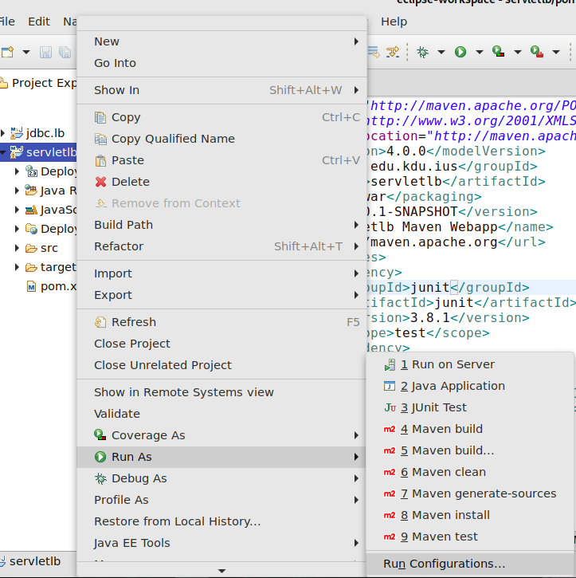

Потрібно створити нову конфігурацію Maven Build:

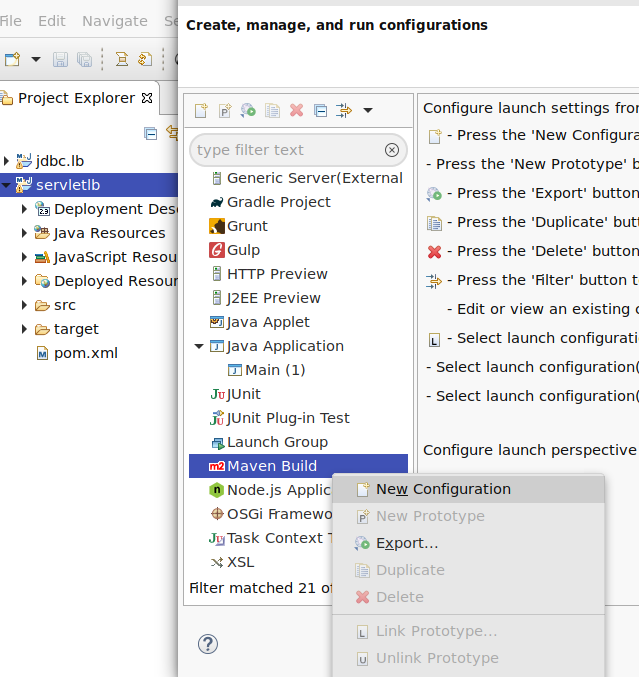

В наступномі вікні потрібно натиснути кнопку Workspace і вибрати проект, а також в полі Goals прописати jetty:run, після чього натиснути кнопку Apply і Run. Наш додаток повинен бути запущений.

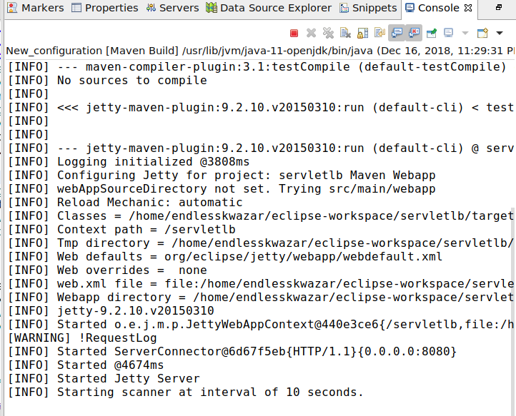

Для перевірки відкрийте браузер і перейдіть по адресі: http://localhost:8080/servletlb

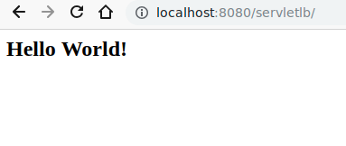

## Створення пешого сервлета

Створіть нову директорію java всередині src/main:

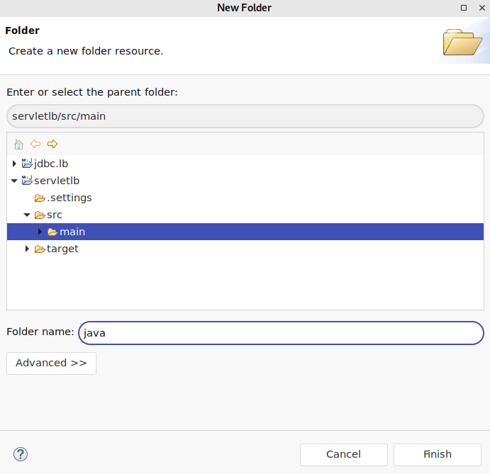

Створіть новий сервлет, в щойно створеній директорії:

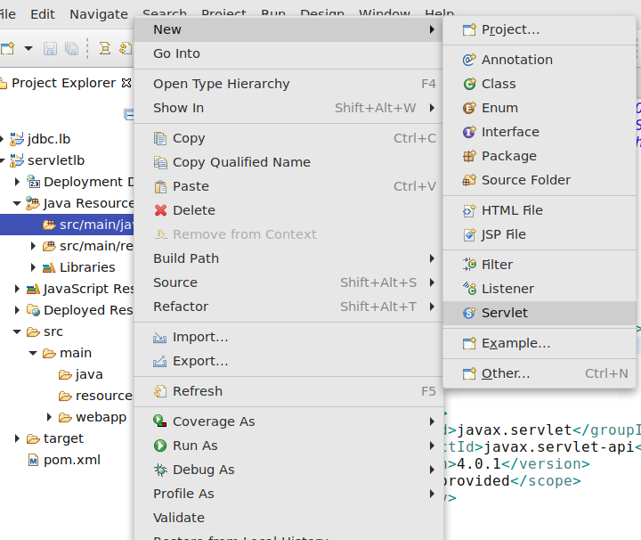

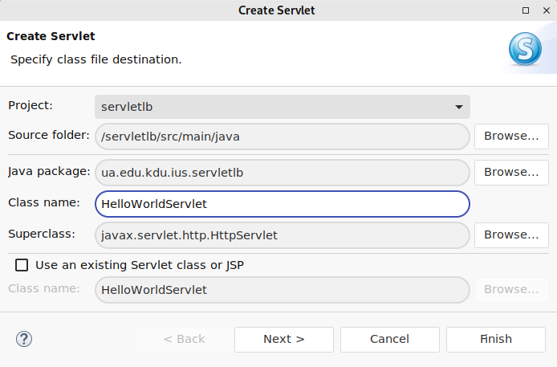

Для того, щоб перевірити, що наш сервлет працює перейдіть в браузері за адресою http://localhost:8080/servletlb/HelloWorldServlet

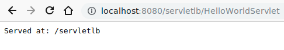

Перепишіть метод doGet класа HelloWorldHttpServlet наступним чином:

```java
protected void doGet(HttpServletRequest request, HttpServletResponse response) throws ServletException, IOException {
		StringBuilder resultHTML = new StringBuilder();
		resultHTML.append("<form method=\"POST\">");
		resultHTML.append("<input type=\"text\" name=\"name\" />");
		resultHTML.append("<input type=\"submit\" />");
		resultHTML.append("</form>");
		response.setContentType("text/html;charset=UTF-8");
		response.getWriter().append(resultHTML);
	}
```

Перепишіть метод doPost наступним чином:

```java
protected void doPost(HttpServletRequest request, HttpServletResponse response) throws ServletException, IOException {	
		String name = request.getParameter("name");
		response.setContentType("text/html;charset=UTF-8");
		if(name == null)
			response.getWriter().append("No name parameter was passed");
		else
			response.getWriter().append("Passed name from form is " + name);
	}
```

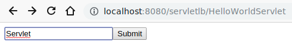

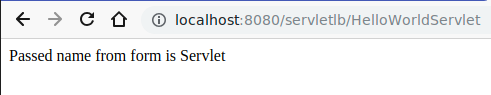
# Домашнє завдання

## Варіанти

1. Розробіть сервлет, який реалізує пошук по двовимірному масиву даних.
2. Створіть хеш-таблицю (HashMap) та розробіть сервлет, який по запиту виводить  значення хеш-таблиці.
3. Створіть хеш-таблицю (HashMap) та розробіть сервлет, який додає нові значення до хеш-таблиці.
4. Створіть хеш-таблицю (HashMap) та розробіть сервлет, який по запиту  вилучає записи з хеш-таблиці.
5. Створіть таблицю (TreeMap) та розробіть сервлет, який по запиту виводить  значення таблиці.
6. Створіть таблицю (TreeMap) та розробіть сервлет, який додає нові значення до таблиці.
7. Створіть таблицю (TreeMap) та розробіть сервлет, який по запиту  вилучає записи з таблиці.
8. Створіть динамічний масив(ArrayList) та розробіть сервлет, який по запиту виводить  значення масиву.
9. Створіть динамічний масив(ArrayList) та розробіть сервлет, який по запиту додає нові значення до масиву.

# Контрольні питання

1. Що таке Servlet?
2. Що таке WEB - контейнер?
3. Опишіть життєвий цикл сервлетів.
4. Назвіть презначення класів HttpServlet, HttpServletRequest  і HttpServletResponse.