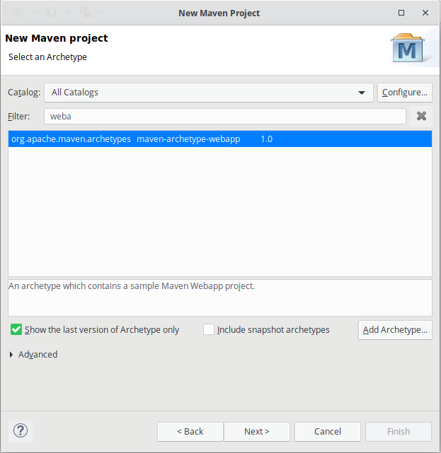
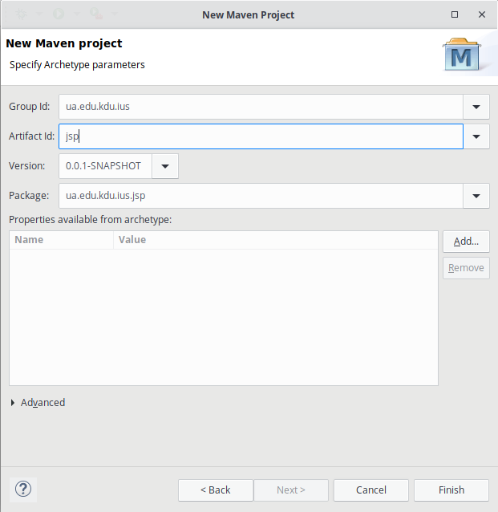

# Що таке JSP?

**Java Server Pages** представляє технологію, яка дозволяє створювати динамічні веб-сторінки. Спочатку JSP (разом з Сервлетами) на зорі розвитку Java EE були домінуючим підходом до веб-розробки на мові Java. І хоча в даний час вони поступилося своїм місцем іншій технології - JSF, проте JSP продовжують широко використовуватися.

По суті Java Server Page або JSP є html-код з вкрапленнями коду Java. У той же час станиці jsp - це не стандартні html-сторінки. Коли приходить запит до певної сторінці JSP, то сервер обробляє її, генерує з неї код html і відправляє його клієнту. В результаті користувач після звернення до сторінці JSP бачить в своєму браузері звичайну html-сторінку.

Як і звичайні статичні веб-сторінки, файли JSP необхідно розміщувати на веб-сервері, до якого звичайні користувачі можуть звертатися по протоколу http, наприклад, набираючи в адресному рядку браузера потрібну адресу. Однак щоб сервер міг обробляти файли JSP, він повинен використовувати движок JSP (JSP engine), який також називають JSP-контейнером. Є безліч движків JSP, і всі вони реалізують одну й ту ж специфікацію і в цілому працюють однаково. Однак тим не менше при перенесенні коду з одного веб-сервера на інший можуть знадобитися невеликі зміни.

# Основи синтаксису JSP

Вміст сторінки JSP фактично ділиться на код html (а також css / javascript) і код на мові java. Для вставки коду Java на сторінку JSP можна використовувати п'ять основних елементів:

- Вирази JSP (JSP Expression)

- Скріплет JSP (JSP Scriplet)

- Оголошення JSP (JSP Declaration)

- Директиви JSP (JSP Directive)

- Коментарі JSP

## JSP Expression

Код, поміщений у тег вираження JSP, записується у вихідний потік відповіді. Так що вам не потрібно писати out.print () для запису даних. В основному це використовується для друку значень змінної або методу.

Синтаксис Jsp виразів

```jsp
<%=  statement %>
```

Наприклад,

```jsp
<%= "This is string" %>

<!-- a is variable -->
<%= a %>
```

## JSP Scriplet

Скриплет JSP дають можливість вставити будь-який код в метод сервлета, який буде створений при обробці сторінки, дозволяючи використовувати більшість конструкцій Java. Скріплет також мають доступ до тих же заздалегідь певним змінним, що і вирази. Тому, наприклад, для виведення значення на сторінку необхідно використовувати заздалегідь певну змінну out.

Синтаксис JSP Скриплетів:

```jsp

<% 
    for(int i = 0; i < 10; i++)
	    out.print(i);
%>

```

## JSP Declaration

Тег декларації JSP використовується для оголошення полів та методів. Код, написаний всередині тегу дессенції jsp, розміщується поза службою () методом автоматично створеного сервлета. Таким чином, він не виділяє пам'яті за кожним запитом.

Синтаксис JSP Declaration:
```jsp
<%! %>
```

Приклад:

```jsp
<%!
int testVar = 3;
%>

<%!
int getTestVar(){
	return testVar;
}
%>

<%= "Test var = " + testVar %>
<%= "Result of getTestVar() = " + getTestVar() %>
```

## JSP Directive

## JSP Comment

# JSP копілюється в Servlet

JSP транслюється в Java-сервлет і обробляє HTTP-запити і генерує відповіді як будь-який сервлет. Однак технологія JSP забезпечує більш зручний спосіб кодування сервлету.

Сторінка JSP обслуговує запити, як сервлет. Отже, життєвий цикл і багато можливостей сторінок JSP (зокрема, динамічні аспекти) визначаються технологією Java Servlet.

JSP-файл компілюються або при першому зверненні до нього, або при старті сервера. Це залежить від налаштувань сервера. Крім того, скомпільовані class-файли можуть зберігатися не в каталозі проекту, а в кеші сервера, тому ви можете їх не виявити навіть після звернення до jsp-сторінці.

# Створення і виконання JSP в середовищі Eclipse з використанням Maven

В середовищі Eclipse створіть новий Maven Project. Виберіть archetype - maven-archytype-webapp



Заповніть необхідну інформацію для створення Maven проекту:



Відкрийте pom.xml і додайте наступну залежність:

```
<dependency>
    <groupId>javax.servlet</groupId>
    <artifactId>javax.servlet-api</artifactId>
    <version>4.0.1</version>
    <scope>provided</scope>
</dependency>
```

Додйте конфігурацю Maven Jetty Plugin всередину тега build -> plugins:

<!-- http://mvnrepository.com/artifact/org.eclipse.jetty/jetty-maven-plugin -->
		<plugins>
			<plugin>
				<groupId>org.eclipse.jetty</groupId>
				<artifactId>jetty-maven-plugin</artifactId>
				<version>9.2.10.v20150310</version>

				<configuration>
					<scanIntervalSeconds>10</scanIntervalSeconds>
					<webApp>
						<contextPath>/servletlb</contextPath>
					</webApp>
				</configuration>

			</plugin>
		</plugins>


# Домашнє завдання

## Варіанти

# Контрольні питання