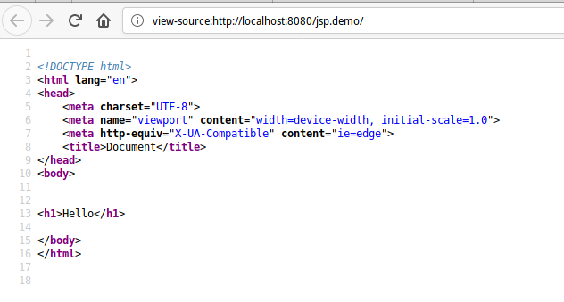

# JSP

# Зміст

${toc}

# Що таке JSP?

**Java Server Pages** представляє технологію, яка дозволяє створювати динамічні веб-сторінки. Спочатку JSP (разом з Сервлетами) на зорі розвитку Java EE були домінуючим підходом до веб-розробки на мові Java. І хоча в даний час вони поступилося своїм місцем іншій технології - JSF, проте JSP продовжують широко використовуватися.

По суті Java Server Page або JSP є html-код з вкрапленнями коду Java. У той же час станиці jsp - це не стандартні html-сторінки. Коли приходить запит до певної сторінці JSP, то сервер обробляє її, генерує з неї код html і відправляє його клієнту. В результаті користувач після звернення до сторінці JSP бачить в своєму браузері звичайну html-сторінку.

Як і звичайні статичні веб-сторінки, файли JSP необхідно розміщувати на веб-сервері, до якого звичайні користувачі можуть звертатися по протоколу http, наприклад, набираючи в адресному рядку браузера потрібну адресу. Однак щоб сервер міг обробляти файли JSP, він повинен використовувати движок JSP (JSP engine), який також називають JSP-контейнером. Є безліч движків JSP, і всі вони реалізують одну й ту ж специфікацію і в цілому працюють однаково. Однак тим не менше при перенесенні коду з одного веб-сервера на інший можуть знадобитися невеликі зміни.

# JSP копілюється в Servlet

JSP транслюється в Java-сервлет і обробляє HTTP-запити і генерує відповіді як будь-який сервлет. Однак технологія JSP забезпечує більш зручний спосіб кодування сервлету.

Сторінка JSP обслуговує запити, як сервлет. Отже, життєвий цикл і багато можливостей сторінок JSP (зокрема, динамічні аспекти) визначаються технологією Java Servlet.

JSP-файл компілюються або при першому зверненні до нього, або при старті сервера. Це залежить від налаштувань сервера. Крім того, скомпільовані class-файли можуть зберігатися не в каталозі проекту, а в кеші сервера, тому ви можете їх не виявити навіть після звернення до jsp-сторінці.

# Основи синтаксису JSP

Вміст сторінки JSP фактично ділиться на код html (а також css / javascript) і код на мові java. Для вставки коду Java на сторінку JSP можна використовувати п'ять основних елементів:

- Вирази JSP (JSP Expression)

- Скріплет JSP (JSP Scriplet)

- Оголошення JSP (JSP Declaration)

- Директиви JSP (JSP Directive)

- Коментарі JSP

## JSP Expression

Код, поміщений у тег вираження JSP, записується у вихідний потік відповіді. Так що вам не потрібно писати out.print () для запису даних. В основному це використовується для друку значень змінної або методу.

Синтаксис Jsp виразів

```jsp
<%=  statement %>
```

Наприклад,

```jsp
<%= "This is string" %>

<!-- a is variable -->
<%= a %>
```

## JSP Scriplet

Скриплет JSP дають можливість вставити будь-який код в метод сервлета, який буде створений при обробці сторінки, дозволяючи використовувати більшість конструкцій Java. Скріплет також мають доступ до тих же заздалегідь певним змінним, що і вирази. Тому, наприклад, для виведення значення на сторінку необхідно використовувати заздалегідь певну змінну out.

Синтаксис JSP Скриплетів:

```jsp

<% 
    for(int i = 0; i < 10; i++)
	    out.print(i);
%>

```

## JSP Declaration

Тег декларації JSP використовується для оголошення полів та методів. Код, написаний всередині тегу дессенції jsp, розміщується поза службою () методом автоматично створеного сервлета. Таким чином, він не виділяє пам'яті за кожним запитом.

Синтаксис JSP Declaration:
```jsp
<%! %>
```

Приклад:

```jsp
<%!
int testVar = 3;
%>

<%!
int getTestVar(){
	return testVar;
}
%>

<%= "Test var = " + testVar %>
<%= "Result of getTestVar() = " + getTestVar() %>
```

## JSP Directive

**Директиви** забезпечують глобальну інформацію, що стосуються конкретних запитів, які направляються в JSP, а також надавати інформацію, необхідну на стадії трансляції.

 Директиви завжди поміщаються на початку JSP-сторінки до всіх інших тегів, щоб parser (аналізатор) JSP при розборі тексту на самому початку виділив глобальні інструкції. Таким, чином, JSP Engine (середа виконання JSP), аналізуючи код, створює з JSP сервлет. Директиви є повідомлення контейнеру JSP.

 Синтаксис директив JSP виглядає наступним чином:

 ```xml
 <%@ директива ім'яАтрибута="значення" %>
 ```

 Директива може мати кілька атрибутів. В цьому випадку директива може бути повторена для кожного з атрибутів. У той же час пари "імяАтрибута = значення" можуть розташовуватися під однією директивою з пропуском як роздільник.

Існує три типи директив:
- page (сторінка)
- taglib (бібліотека тегів)
- include (включити)

### Директива Page

**Директива page** визначає параметри сторінки JSP, які впливають на транслятор. Порядок проходження атрибутів у директиві page не має значення. Порушення синтаксису або наявність нерозпізнаних атрибутів призводить до помилки трансляції. Прикладом директиви page може служити наступний код:

```xml
<%@ page buffer="none" isThreadSafe="yes" errorPage="/error.jsp" %>
```

Ця директива оголошує, що дана сторінка JSP не використовує буферизацию, що можливе одночасне звернення до даної сторінки JSP багатьох користувачів, і що підтримується сторінка помилок з ім'ям error.jsp.
Директива page може містити інформацію про сторінку:

```xml
<% @ Page info = "JSP Sample 1"%>
```

Список можливих атрибутів директиви page представлений в таблиці.

|Атрибут|Значення|Пяснення|
|-|-|-|
|language|Строка|Визначає мову, що використовується в скріптлетах файлу JSP, виражених або будь-яких включаються файлах, в тому числі, в тілі оттранслировать коду. За замовчуванням приймається значення "java"|
|extends|Строка|Задає суперклас для генерується сервлета. Цей атрибут слід використовувати з великою обережністю, оскільки можливе що сервер вже використовує який-небудь суперклас|
|import|Строка|Визначення імпортованих пакетів. Наприклад:&lt;% @ Page import = "java.util. *%&gt;|
|Session|true/false|Значення true (приймається за замовчуванням) свідчить про те, що заздалегідь визначена змінна session (тип HttpSession) повинна бути прив'язана до існуючої сесії, якщо така є, в іншому випадку створюється нова сесія, до якої здійснюється прив'язка. Значення false визначає що сесії не будуть використовуватися, і спроби звернення до змінної session призведуть до виникнення помилки при трансляції JSP сторінки в сервлет|
|Buffer|none або розмір буфера в кБ.|Задає розмір буфера для JspWriter out. Значення приймається за замовчуванням залежить від налаштувань сервера, і не повинно перевищувати 8 кБ. Якщо значення дорівнює none висновок відбувається безпосередньо в об'єкт|
|autoFlush| 	true / false|Визначає, чи повинен буфер звільнятися автоматично, коли він переповнений або сталася помилка. За замовчуванням значення true|
|isThreadSafe|true/false|Значення true (приймається за замовчуванням) задає нормальний режим виконання сервлета, коли множинні запити обробляються одночасно з використанням одного примірника сервлета, виходячи з міркування, що автор синхронізував доступ до змінних цього примірника. Значення false сигналізує про те, що сервлет повинен наслідувати SingleThreadModel (однопоточні модель), при якій послідовні або одночасні запити обробляються окремими примірниками сервлета|
|info|Строка|Визначає рядок інформації про сторінку JSP, яка буде доступна за допомогою методу Servlet.getServletInfo ()|
|errorPage| 	Строка|Значення атрибута являє собою URL сторінку, яка повинна виводитися в разі можливих помилок, що викликають виключення|
|isErrorPage|true / false|Сигналізує про те, чи може ця сторінка використовуватися для обробки помилок для інших JSP сторінок. За замовчуванням приймається значення false|
|contentType|Строка|Визначає кодування для сторінки JSP і відповіді, а також MIME-тип відповіді JSP. Значення за замовчуванням типу змісту - text / html, кодування - ISO-8859-1. наприклад: contentType = "text / html; charset = ISO-8859-1"|
|pageEncoding|Строка|Визначає кодування символів сторінки JSP. За замовчуванням використовується charset з атрибута contentType, якщо воно там визначено. Якщо значення charset в атрибуті contentType не визначене, значення pageEncoding встановлюється рівним ISO-8859-1|


### Директива taglib

Директива taglib оголошує, що дана сторінка JSP використовує бібліотеку тегів, унікальним чином ідентифікуючи її за допомогою URI, і ставить у відповідність префікс тега, за допомогою якого можливі дії в бібліотеці. Якщо контейнер не може знайти бібліотеку тегів, виникає фатальна помилка трансляції.

Директива taglib має наступний синтаксис:

```xml
<%@ Taglib uri = "URI включається бібліотеки тегів" prefix = "імяПрефікса"%>
```

Префікс "імяПрефікса" використовується при зверненні до бібліотеки. Приклад використання бібліотеки тегів mytags:

```xml
<%@ taglib uri="http://www.taglib/mytags" prefix="customs" %>
  . . .
  <customs:myTag>
```

В даному прикладі бібліотека тегів має URI-адреса "http: //www.taglib/mytags", в якості префікса призначений рядок customs, яка використовується в сторінці JSP при зверненні до елементів бібліотеки тегів.


### Директива include

Директива include дозволяє вставляти текст або код в процесі трансляції сторінки JSP в сервлет. Синтаксис директиви include має наступний вигляд:

```xml
<%@ Include file = "Відносний URI включається сторінки"%>
```

Директива include має один атрибут - file. Вона включає текст специфікованого ресурсу в файл JSP. Цю директиву можна використовувати для розміщення стандартного заголовка про авторські права на кожній сторінці JSP:

```xml
<%@ include file="copyright.html" %>
```

Контейнер JSP отримує доступ до файлу, що включається. Якщо файл, який включається змінився, контейнер може перекомпілювати сторінку JSP. Директива include розглядає ресурс, наприклад, сторінку JSP, як статичний об'єкт.

Заданий URI зазвичай інтерпретується щодо JSP сторінки, на якій розташована посилання, але, як і при використанні будь-яких інших відносних URI, можна задати системі становище цікавить ресурсу щодо домашнього каталогу WEB-сервера додаванням в початок URI символу "/". Вміст підключається файлу обробляється як звичайний текст JSP і тому може включати такі елементи, як статичний HTML, елементи скриптів, директиви і дії.

Багато сайтів використовують невелику панель навігації на кожній сторінці. У зв'язку з проблемами використання фреймів HTML часто це завдання вирішується розміщенням невеликий таблиці зверху або в лівій половині сторінки, HTML код якої багаторазово повторюється для кожної сторінки сайту. Директива include - це найбільш природний спосіб вирішення даного завдання, що рятує розробника від кошмару рутини копіювання HTML в кожен окремий файл.

Оскільки директива include підключає файли в ході трансляції сторінки, то після внесення змін до панель навігації потрібна повторна трансляція всіх використовують її JSP сторінок. Якщо ж підключені файли змінюються досить часто, можна використовувати дію jsp: include, яке підключає файл у процесі звернення до JSP сторінці.

**header.jsp**:
```xml
<!DOCTYPE html>
<html lang="en">
<head>
    <meta charset="UTF-8">
    <meta name="viewport" content="width=device-width, initial-scale=1.0">
    <meta http-equiv="X-UA-Compatible" content="ie=edge">
    <title>Document</title>
</head>
<body>

```

**footer.jsp**:
```xml
</body>
</html>
```

**index.jsp**:
```xml
<%@ include file="header.jsp" %>
<h1>Hello</h1>
<%@ include file="footer.jsp" %>
```




## JSP Comment

У JSP-файлі є кілька способів прокоментувати.

1.
```xml
<%-- comment --%>
```

Коментар JSP. Ігнорується движком JSP. Чи не відображається на клієнтському комп'ютері (вихідний код браузера).

2.
```xml
<! - comment ->
```

Коментар HTML. Ігнорується браузером. Він відображається в клієнтській машині (вихідний код браузера) в якості коментаря.

3. 
```xml
<% my code //my comment %>
```

Коментар до окремому рядку Java. Ігнорується компілятором. Чи не відображається на клієнтському комп'ютері (вихідний код браузера).

4.
```xml
<% my code /**
         my comment  **/  
       %>
```

Коментар Java Multi line. Ігнорується компілятором. Чи не відображається на клієнтському комп'ютері (вихідний код браузера).

# Заздалегідь визначенні змінні

Для спрощення коду у виразах JSP і скріплет, надано набір автоматично визначенних змінних, іноді званих неявними об'єктами.

## request

Це об'єкт HttpServletRequest, пов'язаний із запитом, який дозволяє вам звертатися до параметрів запиту (через метод getParameter), типу запиту (GET, POST, HEAD, і т.д ..), і тим, хто HTTP заголовках (cookies, Referer, і т. д ..). Простіше кажучи, request є підкласом ServletRequest і може відрізнятися від HttpServletRequest якщо використовується протокол відмінний від HTTP, що на практиці практично ніколи не зустрічається.

## response

Це об'єкт типу HttpServletResponse, пов'язаний з відповіддю на запит клієнта. Зверніть увагу що, оскільки потік виводу (див. Out далі) буферизованного, можна змінювати коди стану HTTP і заголовки відповідей, навіть якщо це неприпустимо в звичайному Сервлет, але лише в тому випадку якщо якісь дані виведення вже були відправлені клієнту.

## out

Це об'єкт типу PrintWriter, який використовується для відправки виведення клієнту. Однак, щоб зробити об'єкт response (див. Попередній розділ) корисним, слід використовувати буферізірованний варіант PrintWriter - JspWriter. Пам'ятайте що ви можете змінювати розмір буфера і навіть відключити буферизацію, змінюючи значення атрибуту buffer директиви page. Це питання детально розглянуто в Розділі 5. Також зверніть увагу що out використовується практично виключно скріплет, оскільки вираження JSP автоматично розміщуються в потік виводу, що позбавляє від необхідності явного звернення до out.

## session

Це об'єкт типу HttpSession, пов'язаний із запитом. Сесії створюються автоматично, і ця змінна існує навіть якщо немає посилань на вхідні сесії. Єдиним винятком є ​​ситуація, коли ви відключаєте використання сесій використовуючи атрибут session директиви page (див. Розділ 5). У цьому випадку посилання на змінну session призводять до виникнення помилок при трансляції JSP сторінки в сервлет.

# Приклад використання JSP

Створіть в середовищі Eclipse Maven - проект і виберіть architype - webapp:


pom.xml буде такий же самий, як ми використовували для сервлетів:

```xml
<project xmlns="http://maven.apache.org/POM/4.0.0" xmlns:xsi="http://www.w3.org/2001/XMLSchema-instance"
  xsi:schemaLocation="http://maven.apache.org/POM/4.0.0 http://maven.apache.org/maven-v4_0_0.xsd">
  <modelVersion>4.0.0</modelVersion>
  <groupId>ua.com.endlesskwazar</groupId>
  <artifactId>jsp.demo</artifactId>
  <packaging>war</packaging>
  <version>0.0.1-SNAPSHOT</version>
  <name>jsp.demo Maven Webapp</name>
  <url>http://maven.apache.org</url>
  <dependencies>
    <dependency>
      <groupId>junit</groupId>
      <artifactId>junit</artifactId>
      <version>3.8.1</version>
      <scope>test</scope>
    </dependency>
    
    <dependency>
			<groupId>javax.servlet</groupId>
			<artifactId>javax.servlet-api</artifactId>
			<version>4.0.1</version>
			<scope>provided</scope>
		</dependency>
  </dependencies>
  <build>
    <finalName>jsp.demo</finalName>
    
    <plugins>
			<plugin>
				<groupId>org.eclipse.jetty</groupId>
				<artifactId>jetty-maven-plugin</artifactId>
				<version>9.2.10.v20150310</version>

				<configuration>
					<scanIntervalSeconds>10</scanIntervalSeconds>
					<webApp>
						<contextPath>/jsp.demo</contextPath>
					</webApp>
				</configuration>

			</plugin>
		</plugins>
  </build>
</project>
```

В директорії webapp вже знаходиться один jsp файл - index.js:


Модифікуємо вміст index.jsp:

```html
<html>
<body>
<h2>Hello World!</h2>

<form action="form-response.jsp">
	<h2>Enter some name</h2>
	<input name="name" /><br>
	<input type="submit">
</form>

</body>
</html>
```

І створимо новий файл form-response.jsp:

```html
<html>
<body>
<h2>Hello World!</h2>

<p>
<%
String name = request.getParameter("name");

if(name == null)
	out.print("No name parameter was passed");
else
	out.print("Passed name from form is " + name);
%>
</p>

</body>
</html>
```


- Проект доступний за адресою [java-ee-examples](https://github.com/endlesskwazar/java-ee-examples)
- Гілка jsp-example

# Створенна власного тега JSP

Для того, щоб мати можливість розробляти власні теги, крім servlet-api, нам знадобиться servlet.jsp-api:

```xml
<project xmlns="http://maven.apache.org/POM/4.0.0"
	xmlns:xsi="http://www.w3.org/2001/XMLSchema-instance"
	xsi:schemaLocation="http://maven.apache.org/POM/4.0.0 http://maven.apache.org/maven-v4_0_0.xsd">
	<modelVersion>4.0.0</modelVersion>
	<groupId>ua.com.endlesskwazar</groupId>
	<artifactId>custom.jsp.tag</artifactId>
	<packaging>war</packaging>
	<version>0.0.1-SNAPSHOT</version>
	<name>custom.jsp.tag Maven Webapp</name>
	<url>http://maven.apache.org</url>
	<dependencies>
		<dependency>
			<groupId>junit</groupId>
			<artifactId>junit</artifactId>
			<version>3.8.1</version>
			<scope>test</scope>
		</dependency>

		<dependency>
			<groupId>javax.servlet</groupId>
			<artifactId>javax.servlet-api</artifactId>
			<version>4.0.1</version>
			<scope>provided</scope>
		</dependency>

		<dependency>
			<groupId>javax.servlet.jsp</groupId>
			<artifactId>javax.servlet.jsp-api</artifactId>
			<version>2.3.3</version>
			<scope>provided</scope>
		</dependency>
	</dependencies>
	<build>
		<finalName>custom.jsp.tag</finalName>

		<plugins>
			<plugin>
				<groupId>org.eclipse.jetty</groupId>
				<artifactId>jetty-maven-plugin</artifactId>
				<version>9.2.10.v20150310</version>

				<configuration>
					<scanIntervalSeconds>10</scanIntervalSeconds>
					<webApp>
						<contextPath>/custom.jsp.tag</contextPath>
					</webApp>
				</configuration>

			</plugin>
		</plugins>
	</build>
</project>
```

Припустимо, ми хочемо показати номер із форматуванням комами та пробілами. Це може бути дуже корисно для користувача, коли номер дійсно довгий. Отже, ми хочемо, щоб були деякі спеціальні теги:

```html
<mytags:formatNumber number="100050.574" format="#,###.00"/>
```

## Custom Tag Handler

Це перший крок у створенні власних тегів у JSP. Все, що нам потрібно зробити - це розширити клас javax.servlet.jsp.tagext.SimpleTagSupport і перевизначити метод doTag().

Важливо відзначити, що для атрибутів, які потрібні для тегу, ми повинні мати методи сеттера. Отже, ми визначимо два методи встановлення - setFormat (формат String) і setNumber (номер рядка).

SimpleTagSupport надає методи, за допомогою яких ми можемо отримати об'єкт JspWriter і записати дані у відповідь. Ми будемо використовувати клас DecimalFormat для створення форматованого рядка, а потім записати його у відповідь. Остаточна реалізація наведена нижче.

```java
package custom.jsp.tag;

import java.io.IOException;
import java.text.DecimalFormat;

import javax.servlet.jsp.JspException;
import javax.servlet.jsp.SkipPageException;
import javax.servlet.jsp.tagext.SimpleTagSupport;

public class NumberFormatterTag extends SimpleTagSupport {
	
	private String format;
	
	private String number;
	
	public NumberFormatterTag() {
		
	}
	
	public void setFormat(String format) {
		this.format = format;
	}

	public void setNumber(String number) {
		this.number = number;
	}
	
	@Override
	public void doTag() throws JspException, IOException {
		System.out.println("Number is:" + number);
		System.out.println("Format is:" + format);
		try {
			double amount = Double.parseDouble(number);
			DecimalFormat formatter = new DecimalFormat(format);
			String formattedNumber = formatter.format(amount);
			getJspContext().getOut().write(formattedNumber);
		} catch (Exception e) {
			e.printStackTrace();
			// зупини завантаження сторінки і кинути SkipPageException
			throw new SkipPageException("Exception in formatting " + number
					+ " with format " + format);
		}
	}

}
```

## JSP Custom Tag Library Descriptor (TLD)

Після того, як клас обробника тегів буде готовий, нам потрібно визначити файл TLD у каталозі WEB-INF, щоб контейнер завантажив його після розгортання програми.

**numberformatter.tld**:
```xml
<?xml version="1.0" encoding="UTF-8" ?>

<taglib xmlns="http://java.sun.com/xml/ns/j2ee"
    xmlns:xsi="http://www.w3.org/2001/XMLSchema-instance"
    xsi:schemaLocation="http://java.sun.com/xml/ns/j2ee http://java.sun.com/xml/ns/j2ee/web-jsptaglibrary_2_0.xsd"
    version="2.0">
<description>Number Formatter Custom Tag</description>
<tlib-version>2.1</tlib-version>
<short-name>mytags</short-name>
<uri>https://endlesskwazar.com.ua/tlds/my-tags</uri>
<tag>
	<name>formatNumber</name>
	<tag-class>custom.jsp.tag.NumberFormatterTag</tag-class>
	<body-content>empty</body-content>
	<attribute>
	<name>format</name>
	<required>true</required>
	</attribute>
	<attribute>
	<name>number</name>
	<required>true</required>
	</attribute>
</tag>
</taglib>
```

## Custom Tag Deployment Descriptor Configuration

**web.xml**:

```xml
<?xml version="1.0" encoding="UTF-8"?>

<web-app xmlns:xsi="http://www.w3.org/2001/XMLSchema-instance"
 xmlns="http://java.sun.com/xml/ns/javaee"
  xsi:schemaLocation="http://java.sun.com/xml/ns/javaee http://java.sun.com/xml/ns/javaee/web-app_3_0.xsd"
   version="3.0">
  <display-name>Archetype Created Web Application</display-name>
  
  <jsp-config>
  <taglib>
  	<taglib-uri>https://endlesskwazar.com.ua/tlds/my-tags</taglib-uri>
  	<taglib-location>/WEB-INF/numberformatter.tld</taglib-location>
  </taglib>
  </jsp-config>
</web-app>
```


- Проект доступний за адресою [java-ee-examples](https://github.com/endlesskwazar/java-ee-examples)
- Гілка jsp-custom-tag-example

# Домашнє завдання

Створіть власний JSP - тег, який винконує завдання згідно із варіантом.

## Варіанти

1. Виводить текст повністю капсом.
2. Виводить текст красним кольором.
3. Додає певний текст до початку даного.
4. Додає певний текст в кінець даного.
5. Розбиває текст по пробілах і виводить кожне слово із нової строчки.
6. Шукає в тексті цифру один і, конвертує її в слово "один".
7. Перевіряє чи входе число в певний діапазон.
8. Видаляє всі пробіли із тексту.
9. Ескейпи відкриваючі і закриваючі html - теги в тексті на \&lt; \&gt;

# Контрольні питання

1. Що таке JSP?
2. Як можна вставити код в JSP сторінку?
3. Опишіть процес створення влосного JSP - тега.