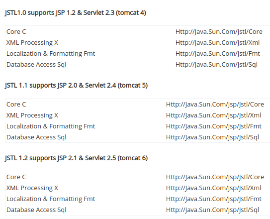
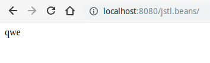
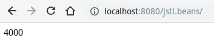
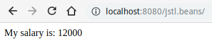
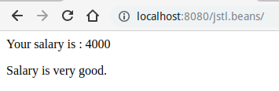
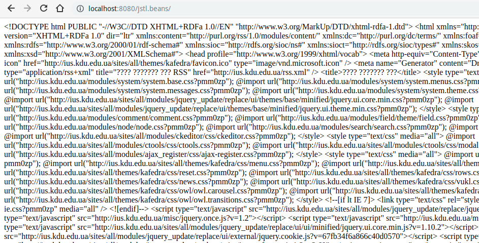
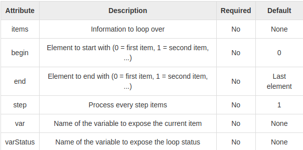
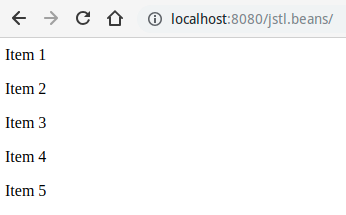
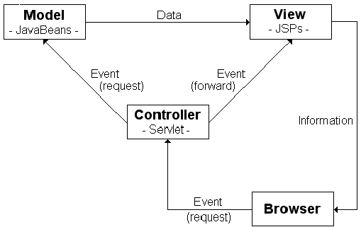

# Java Beans and JSP

# Зміст

${toc}

# Java Beans

**JavaBeans** - класи в мові Java, написані за певними правилами. Вони використовуються для об'єднання декількох об'єктів в один (англ. Bean - квасоля, кавове зерно) для зручної передачі даних.

Щоб клас міг працювати як bean, він повинен відповідати певним угодам про імена методів, конструктора і поведінці. Ці угоди дають можливість створення інструментів, які можуть використовувати, заміщати і з'єднувати JavaBeans.

Правила опису наступні:
- Клас повинен мати конструктор без параметрів, з модифікатором доступу public. Такий конструктор дозволяє інструментам створити об'єкт без додаткових складнощів з параметрами.
- Властивості класу повинні бути доступні через get, set.
- Клас повинен бути серіалізованим. Це дає можливість надійно зберігати, і відновлювати стан bean незалежним від платформи і віртуальної машини.
- Клас повинен мати перевизначені методи equals (), hashCode () і toString ().

Так як вимоги в основному викладені у вигляді угоди, а не інтерфейсу, деякі розробники розглядають JavaBeans, як Plain Old Java Objects, які слідують певним правилам іменування.

**POJO** (англ. Plain Old Java Object) - «Старий добрий Java-об'єкт», простий Java-об'єкт, який не успадкований від якогось специфічного об'єкта і не реалізує жодних службових інтерфейсів окрім тих, які потрібні для бізнес-моделі.

# Інтеграція JSP із Java Bean

## Декларація використання Java Bean в JSP
Дія useBean оголошує JavaBean для використання в JSP. Після того, як оголошений, bean стає змінною сценаріїв, до якої можуть звертатися як елементи сценаріїв, так і інші користувацькі теги, які використовуються в JSP. Повний синтаксис тегу useBean такий -

```xml
<jsp:useBean id = "bean's name" class="class of java bean" scope = "bean's scope"/>
```

**де**:
- id - унікальний ідентифікатор bean
- class - шлях до класу bean
- scope - область видимості

**Область видимості оголошеного JavaBean за допомогою useBean**:
- page - Об'єкт, визначений з областю видимості page, доступний до тих пір, поки не буде відправлена відповідь клієнту або поки запит до поточної сторінці JSP НЕ буде перенаправлений куди-небудь ще.
- request - Об'ект, що має зону видимості request, існує і доступний протягом поточного запиту, і залишається видимим, навіть якщо запит перенаправляється іншому ресурсу в тому ж самому циклі виконання.
- session - Об'єкт, що має зону видимості session доступний протягом поточного сеансу, якщо сторінка JSP "знає" про сеанс.
- application - Об'єкт, що має зону видимості application доступний сторінкам, що обробляють запити в одному і тому ж додатку Web

## Читання і встановлення властивостей

Тег jsp:setProperty дозволяє присвоювати значення властивостей компоненту JavaBean, який повинен бути попередньо створений дією jsp:useBean і містити відповідні властивості властивості. Дія jsp:setProperty має наступний синтаксис:

```xml
 <jsp:setProperty name="ідентифікатор" 
      property = "ім'я властивості" | value = "значення" | 
  />
```

Після оголошення компонента JavaBean за допомогою дії jsp: useBean його незахищені властивостей стають доступними для дії jsp: getProperty. Тег jsp: getProperty робить властивості компонента JavaBean видимими. Даний тег включає значення типу String або об'єкт типу, перетворений до типу String, в вихідний потік. Перетворення простих типів в тип String відбувається автоматично. Для об'єктів необхідний виклик методу toString.

```xml
 <jsp:getProperty name="ідентифікатор" 
       property = "ім'я властивості"  
/>
```

## Приклад застосунка із використання JavaBeans в JSP

Нехай дано bean:

```java
package jsp.beans.domain;

public class Person {
	private String name;
	private Integer age;
	private String phoneNumber;
	
	public String getName() {
		return name;
	}
	public void setName(String name) {
		this.name = name;
	}
	public Integer getAge() {
		return age;
	}
	public void setAge(Integer age) {
		this.age = age;
	}
	public String getPhoneNumber() {
		return phoneNumber;
	}
	public void setPhoneNumber(String phoneNumber) {
		this.phoneNumber = phoneNumber;
	}
	
	public Person() {}
}
```

Сторінка форми додавання виглядає наступним чином:

```xml
<%@ page language="java" contentType="text/html; charset=UTF-8"
    pageEncoding="UTF-8"%>
<!DOCTYPE html>
<html>
<head>
<meta charset="UTF-8">
<title>Add person page</title>
</head>
<body>

<h1>Add person form</h1>

<form method="post" action="showInfo.jsp">
	name: <input type="text" name="name" /> <br/>
	age: <input type="text" name="age" /> <br/>
	phoneNumber: <input type="text" name="phoneNumber" /><br/>
	<input type="submit">
</form>

</body>
</html>
```

Сторінка для обробки цієї форми:

```xml
<%@ page language="java" contentType="text/html; charset=UTF-8"
    pageEncoding="UTF-8"%>
<!DOCTYPE html>
<html>
<head>
<meta charset="UTF-8">
<title>Info about person</title>
</head>
<body>

<jsp:useBean id="person" class="jsp.beans.domain.Person" scope="page">
	<jsp:setProperty name="person" property="*" />
</jsp:useBean>

<%= person.getName()  %>

</body>
</html>
```

Завантажити проект можна з рипозиторія [java-ee-examples](https://github.com/endlesskwazar/java-ee-examples.git)
гілка - beans-example

# JSTL

**Стандартна бібліотека тегів JSP** (англ. JavaServer Pages Standard Tag Library, JSTL) - розширення специфікації JSP, що додає бібліотеку JSP тегів для загальних потреб, таких як розбір XML даних, умовна обробка, створення циклів і підтримка інтернаціоналізації. JSTL - кінцевий результат JSR 52, розробленого в рамках процесу спільноти Java.


## Налаштування середовища для роботи із JSTL

При використанні Maven потрібно додати залежність на jstl:

```xml
<dependency>
	<groupId>javax.servlet.jsp.jstl</groupId>
	<artifactId>jstl-api</artifactId>
	<version>1.2</version>
</dependency>
```

Ви також повинні переконатися, що ваш web.xml оголошений відповідним принаймні Servlet 2.4 і, таким чином, не як Servlet 2.3 або старше. В іншому випадку EL-вирази в тегах JSTL  не працюватимуть. Виберіть найвищу версію, що відповідає вашому цільовому контейнеру, і переконайтеся, що у вашому web.xml немає <! DOCTYPE>.

```xml
<web-app  xmlns="http://java.sun.com/xml/ns/javaee"
    xmlns:xsi="http://www.w3.org/2001/XMLSchema-instance"
    xsi:schemaLocation="http://java.sun.com/xml/ns/javaee http://java.sun.com/xml/ns/javaee/web-app_4_0.xsd"
    version="4.0">
  <display-name>Archetype Created Web Application</display-name>
</web-app>
```



[Cannot Find The Tag Library Descriptor ](https://www.javatips.net/blog/cannot-find-the-tag-library-descriptor-for-http-java-sun-com-jsp-jstl-core)

## JSTL теги

Класифікація jstl - тегів:

|Група|Пояснення|Підключення|
|-|-|-|
|Core Tags|Основна група тегів - це найчастіше використовувані теги JSTL|``` <%@ taglib prefix = "c" uri = "http://java.sun.com/jsp/jstl/core" %>```|
|Formatting tags|Теги форматування JSTL використовуються для форматування та відображення тексту, дати, часу та номерів для інтернаціоналізованих веб-сайтів.|``` <%@ taglib prefix = "fmt" uri = "http://java.sun.com/jsp/jstl/fmt" %>```|
|SQL tags|Бібліотека тегів JSTL SQL надає теги для взаємодії з реляційними базами даних (RDBMS), такими як Oracle, mySQL або Microsoft SQL Server.|``` <%@ taglib prefix = "sql" uri = "http://java.sun.com/jsp/jstl/sql" %>```|
|XML tags|Теги JSTL XML забезпечують JSP-орієнтований спосіб створення та маніпулювання XML-документами. Нижче наведено синтаксис для включення бібліотеки JSTL XML у ваш JSP.|``` <%@ taglib prefix = "x" uri = "http://java.sun.com/jsp/jstl/xml" %>```|
|JSTL Functions|JSTL включає в себе ряд стандартних функцій, більшість з яких є загальними функціями маніпулювання рядками.|``` <%@ taglib prefix = "fn" uri = "http://java.sun.com/jsp/jstl/functions" %>```|

### JSTL Core tags

#### c:out

Тег ``` <c: out>``` відображає результат виразу. Це майже аналогічно тому, як працює ``` <% =%>```. Різниця тут полягає в тому, що тег ``` <c: out>``` дозволяє використовувати простіший "." нотації для доступу до властивостей. Наприклад, щоб отримати доступ до customer.address.street, використовуйте тег ```<c: out value = "customer.address.street" />```.

Тег ```<c: out>``` може автоматично уникати тегів XML, щоб вони не оцінювалися як фактичні теги.

```xml
<%@ taglib uri="http://java.sun.com/jsp/jstl/core" prefix="c"%>
<html>
<body>
<c:out value="qwe" />
</body>
</html>
```



#### c:set

Тег ``` <c: set>``` є зручною для JSTL версією дії setProperty. Тег корисний, оскільки він оцінює вираз і використовує результати для встановлення значення JavaBean.

```xml
<%@ taglib uri="http://java.sun.com/jsp/jstl/core" prefix="c"%>
<html>
<body>
<c:set var = "salary" scope = "session" value = "${2000*2}"/>
<c:out value = "${salary}"/>
</body>
</html>
```



#### c:remove

Тег ``` <c: remove>``` видаляє змінну із зазначеного діапазону або першої області, де знайдена змінна (якщо не вказано область). Ця дія не є особливо корисною, але вона може допомогти у забезпеченні того, щоб JSP очистив усі обмежені ресурси, за які він відповідає.

```xml
<c:set var = "salary" scope = "session" value = "${2000*2}"/>
<p>Before Remove Value: <c:out value = "${salary}"/></p>
<c:remove var = "salary"/>
<p>After Remove Value: <c:out value = "${salary}"/></p>
```


#### c:if

Тег ``` <c: if>``` виконує вираз і відображає його вміст тіла, лише якщо вираз обчислюється як істина.

```xml
<c:set var = "salary" scope = "session" value = "${2000*6}"/>
<c:if test = "${salary > 2000}">
<p>My salary is:  <c:out value = "${salary}"/><p>
</c:if>
```




#### c:choose

``` <c: choose>``` працює як оператор перемикання Java, оскільки дозволяє вибирати між декількома альтернативами. У випадку, коли в операторі switch є оператори case, тег ```<c: choose>``` має ```<c:when>``` теги. Так само, як оператор switch має умова за замовчуванням, щоб вказати дію за замовчуванням, ```<c: choose>``` має ```<c:otherwise>``` як умова за замовчуванням.

```xml
<c:set var = "salary" scope = "session" value = "${2000*2}"/>
<p>Your salary is : <c:out value = "${salary}"/></p>
<c:choose>
         
	<c:when test = "${salary <= 0}">
		Salary is very low to survive.
	</c:when>
         
	<c:when test = "${salary > 1000}">
   	 Salary is very good.
	</c:when>
         
	<c:otherwise>
   	 No comment sir...
	</c:otherwise>
</c:choose>
```




#### c:import

Тег ```<c: import>``` надає всі функціональні можливості дії ```<include>```, але також допускає включення абсолютних URL-адрес.

```xml
<c:import var = "data" url = "http://ius.kdu.edu.ua"/>
<c:out value = "${data}"/>
```




#### c:forEach

Цей тег існує як гарна альтернатива вбудовуванню циклу Java для, в той час, або do-while через scriptlet. Тег ```<c: forEach>`` є часто використовуваним тегом, оскільки він перебирає колекцію об'єктів.



```xml
<c:forEach var = "i" begin = "1" end = "5">
   <p>Item <c:out value = "${i}"/><p>
</c:forEach>
```




#### c:redirect

Тег ```<c: redirect>``` перенаправляє браузер на альтернативну URL-адресу, полегшуючи автоматичне переписування URL-адрес, підтримує URL-адреси, пов'язані з контекстом, а також підтримує тег ```<c: param>```.

```xml
 <c:redirect url = "http://www.photofuntoos.com"/>
```

# Реалізаця патерна MVC, використовуючи Servlets, JSP, JSTL, Java Beans, JDBC




## Приклад застосунка MVC, Servlets, JSP, Bean, JSTL, JDBC

Репозиторій - [java-ee-examples](https://github.com/endlesskwazar/java-ee-workbook)
гілка - mvc-example

# Домашня робота

Доробіть в проекті mvc всі crud операції для моделі Person.

# Контрольні запитання

1. Що таке Java Bean?
2. Як JSP може взаємодіяти із Java Beans?
3. Що таке JSTL?
4. Перелічіть і поясніть теги в групі JSTL Core.