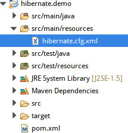

# JPA. Hibernate.

# Зміст

${toc}

# Що таке JPA?

**JPA** (Java Persistence API) це специфікація Java EE, що описує систему управління збереженням java об'єктів в таблиці реляційних баз даних в зручному вигляді. Сама Java не містить реалізації JPA, проте існує багато реалізацій даної специфікації від різних компаній (відкритих і немає). Це не єдиний спосіб збереження java об'єктів в бази даних (ORM систем), але один з найпопулярніших в Java світі.

Існує кілька реалізацій цього інтерфейсу, одна з найпопулярніших використовує для цього Hibernate. JPA реалізує концепцію ORM.

# ORM

В об'єктно-орієнтованому програмуванні об'єкти в програмі представляють об'єкти з реального світу. Як приклад можна розглянути адресну книгу, яка містить список людей разом з кількома телефонами і кількома адресами. В термінах об'єктно-орієнтованого програмування вони представлятимуться об'єктами класу «Людина», які міститимуть наступний список полів: ім'я, список (або масив) телефонів і список адрес.

Суть проблеми полягає в перетворенні таких об'єктів у форму, в якій вони можуть бути збережені у файлах або базах даних, і які легко можуть бути витягнуті в подальшому, зі збереженням властивостей об'єктів і відношень між ними. Ці об'єкти називають «постійними» (англ. persistent). Історично існує кілька підходів до рішення цієї задачі.

**ORM** (англ. Object-relational mapping, Об'єктно-реляційна проекція) — технологія програмування, яка зв'язує бази даних з концепціями об'єктно-орієнтованих мов програмування, створюючи «віртуальну об'єктну базу даних».


# Entity

**Entity** (Сутність) - POJO-клас, пов'язаний з БД за допомогою анотації (@Entity) або через XML. До такого класу ставляться такі вимоги:
- Повинен мати порожній конструктор (public або protected)
- Не може бути вкладеним, інтерфейсом або enum
- Не може бути final і не може містити final-полів / властивостей
- Повинен містити хоча б одне @id-поле

При цьому entity може:
- Містити непусті конструктори
- Успадковуватися і бути успадкованим
- Містити інші методи і реалізовувати інтерфейси

# Hibernate

**Hibernate** — засіб відображення між об'єктами та реляційними структурами (object-relational mapping, ORM) для платформи Java. Hibernate є вільним програмним забезпеченням, яке поширюється на умовах GNU Lesser General Public License. Hibernate надає легкий для використання каркас (фреймворк) для відображення між об'єктно-орієнтованою моделлю даних і традиційною реляційною базою даних.

## Переваги Hibernate

- Hibernate усуває безліч спагетті коду (повторюваного), який постійно переслідує розробника при роботі з JDBC. Приховує від розробника безліч коду, необхідного для управління ресурсами і дозволяє зосередитися на бізнес логіці.
- Hibernate підтримує XML так само як і JPA анотації, що дозволяє зробити реалізацію коду незалежною.
- Hibernate надає власний потужний мову запитів (HQL), який схожий на SQL. Варто відзначити, що HQL повністю об'єктно-орієнтований і розуміє такі принципи, як успадкування, поліморфізм і асоціації (зв'язку).
- Hibernate - широко поширений open source проект. Завдяки цьому доступні тисячі відкритих статей, прикладів, а так само документації по використанню фреймворка.
- Hibernate легко інтегрується з іншими Java EE фреймворками, наприклад, Spring Framework підтримує вбудовану інтеграцію з Hibernate.
- Hibernate підтримує ледачу ініціалізацію використовуючи proxy об'єкти і виконує запити до бази даних тільки по необхідності.
- Hibernate підтримує різні рівні cache, а отже може підвищити продуктивність.
- Важливо, що Hibernate може використовувати чистий SQL, а значить підтримує можливість оптимізації запитів і роботи з будь-яким стороннім вендором БД і його фичами.

## Переваги Hibernate в порівнянні із JDBC

- Hibernate підтримує спадкування, асоціації та колекції, що не доступно в JDBC API.
- Hibernate неявно використовує управління транзакціями. Більшість запитів не можна виконати поза транзакції. При використанні JDBC API для управління транзакціями потрібно явно використовувати commit і rollback.
- JDBC API throws SQLException, яке відноситься до перевіряється винятків, а значить необхідно постійно писати безліч блоків try-catch. У більшості випадків це не потрібно для кожного виклику JDBC і використовується для управління транзакціями. Hibernate обертає виключення JDBC через непроверяемие JDBCException або HibernateException, а значить немає необхідності перевіряти їх в коді кожен раз. Вбудована підтримка управління транзакціями в Hibernate прибирає блоки try-catch.
- Hibernate Query Language (HQL) більш об'єктно орієнтований і близький до Java мова запитів, ніж SQL в JDBC.
- Hibernate підтримує анотації JPA, а значить код є стерпним на інші ORM фреймворки, що реалізують стандарт, в той час як код JDBC сильно прив'язаний до додатка.

## Як працює Hibernate

У Hibernate робота з БД здійснюється через об'єкт типу org.hibernate.Session

Інтерфейс org.hibernate.Session є мостом між додатком і Hibernate. За допомогою сесій виконуються всі CRUD-операції з об'єктами-сутностями. Об'єкт типу Session отримують з org.hibernate.SessionFactory, який повинен бути присутнім в додатку у вигляді singleton.

### Стани об'єктів

Об'єкт-сутність може перебувати в одному з 3-х станів (статусів):

- **transient object**. Об'єкти в даному статусі - це заповнені екземпляри класів-сутностей. Можуть бути збережені в БД. Не приєднані до сесії. Поле Id не повинно бути заповнене, інакше об'єкт має статус detached;
- **persistent object**. Об'єкт в даному статусі - так звана збережена сутність, яка приєднана до конкретної сесії. Тільки в цьому статусі об'єкт взаємодіє з базою даних.
- **detached object**. Об'єкт в даному статусі - це об'єкт, від'єднаний від сесії, може існувати або не існувати в БД.

Будь-який об'єкт сутність можна переводити з одного статусу в інший. Для цього в інтерфейсі Session існують такі методи:

- **persist (Object)** - перетворює об'єкт з transient в persistent, тобто приєднує до сесії і зберігає в БД. Однак, якщо ми призначимо значення полю Id об'єкта, то отримаємо PersistentObjectException - Hibernate вважатиме, що об'єкт detached, тобто. Існує в БД. При збереженні метод persist () відразу виконує insert, не роблячи select.
- **merge (Object)** - перетворює об'єкт з transient або detached в persistent. Якщо з transient, то працює аналогічно persist () (генерує для об'єкта новий Id, навіть якщо він заданий), якщо з detached - завантажує об'єкт з БД, приєднує до сесії, а при збереженні виконує запит update.
- **save (Object)** - зберігає об'єкт в БД, генеруючи новий Id, навіть якщо він встановлений. Object може бути в статусі transient або detached
- **update (Object)** - оновлює об'єкт в БД, перетворюючи його в persistent (Object в статусі detached)
- **saveOrUpdate (Object)** - викликає save () або update ()
- **refresh (Object)** - оновлює detached-об'єкт, виконавши select до БД, і перетворює його в persistent
- **get (Object.class, id)** - отримує з БД об'єкт класу-сутності з певним Id в статусі persistent


# Конфігурація Hibernate

## Налаштування сутностей

### XML
         
```xml
<hibernate-mapping>
    <class name="com.devcolibri.entity.User" table="user" catalog="test">
        <id name="userId" type="java.lang.Integer">
            <column name="USER_ID" />
            <generator class="identity" />
        </id>
        <property name="firstName" type="string">
            <column name="FIRST_NAME" length="20" not-null="true" unique="true" />
        </property>
        <property name="lastName" type="string">
            <column name="LAST_NAME" length="20" not-null="true" unique="true" />
        </property>
    </class>
</hibernate-mapping>
```

### Анотації

#### @Entity

Стандартна анотація EJB, яка містяться в пакеті javax.persistence, тому ми імпортуємо цей пакет як перший крок. По-друге, ми використали анотацію @Entity до класу, який позначає цей клас як об'єктну сутність, тому він повинен мати конструктор без аргументів.

#### @Table

Анотація @Table дозволяє вказувати деталі таблиці, яка буде використана для збереження об'єкта в базі даних.

Анотація @Table містить атрибути, що дозволяють перевизначити назву таблиці, префікс схеми.

#### @Id @GeneratedValue

Кожен компонент об'єктної сутності буде мати первинний ключ, який ви коментуєте в класі з @Id анотацією. Первинним ключем може бути одне поле або комбінація з декількох полів залежно від структури таблиці.

За замовчуванням анотація @Id автоматично визначає найбільш підходящу стратегію генерації первинного ключа, але ви можете змінити це, застосувавши анотацію @GeneratedValue, яка приймає стратегію.

#### @Column

Анотація @Column використовується для визначення деталей стовпця, до якого буде зіставлено поле або властивість. Можна використовувати анотацію стовпця з такими найчастіше використовуваними атрибутами:
- Атрибут name дозволяє явно вказати ім'я стовпця.
- Атрибут length дозволяє вказати розмір стовпця, який використовується для зіставлення значення, особливо для значення String.
- Атрибут nullable надає можливість стовпцям бути позначені NOT NULL при створенні схеми.
- Атрибут unique дозволяє позначити стовпець, що містить лише унікальні значення.


# One to One

## One to One by primary key

```java
імпортувати javax.persistence.Column;
імпортувати javax.persistence.Entity;
import javax.persistence.GeneratedValue;
import javax.persistence.GenerationType;
імпортувати javax.persistence.Id;
імпортувати javax.persistence.Table;
 
/ **
 * Користувач системи
 * /
@Entity
@Table (name = "users")
User public class {
     
    @Id
    @Column (name = "id")
    @GeneratedValue (strategy = GenerationType.AUTO)
    private Long id;
     
    / **
     * Поля спільні для всех користувачів
     * /
}
```

```java
import javax.persistence.CascadeType;
import javax.persistence.Column;
import javax.persistence.Entity;
import javax.persistence.GeneratedValue;
import javax.persistence.GenerationType;
import javax.persistence.Id;
import javax.persistence.OneToOne;
import javax.persistence.PrimaryKeyJoinColumn;
import javax.persistence.Table;
 
/ **
 * Партнер системи
 * /
@Entity
@Table (name = "partners")
public class Partner {
 
    @OneToOne (cascade = CascadeType.ALL)
    @PrimaryKeyJoinColumn
    private User user;
     
     
    @Id
    @Column (name = "id")
    @GeneratedValue (strategy = GenerationType.AUTO)
    private Long id;
     
    / **
     * Поля даних партнерів системи
     * /
}
```

## One To One with fireign key

```java
import javax.persistence.CascadeType;
import javax.persistence.Column;
import javax.persistence.Entity;
import javax.persistence.GeneratedValue;
import javax.persistence.GenerationType;
import javax.persistence.Id;
import javax.persistence.JoinColumn;
import javax.persistence.OneToOne;
import javax.persistence.Table;
 
@Entity
@Table(name = "users")
public class User {
     
    @Id
    @Column(name = "id")
    @GeneratedValue(strategy = GenerationType.AUTO)
    private Long id;
     
    @OneToOne(cascade = CascadeType.ALL)
    @JoinColumn(name="passport_id")
    private Passport passport;
}
```

```java
import javax.persistence.Column;
import javax.persistence.Entity;
import javax.persistence.GeneratedValue;
import javax.persistence.GenerationType;
import javax.persistence.Id;
import javax.persistence.OneToOne;
import javax.persistence.Table;
 
@Entity
@Table(name = "passports")
public class Passport {
 
    @Id
    @Column(name = "id")
    @GeneratedValue(strategy = GenerationType.AUTO)
    private Long id;
     
    @OneToOne(mappedBy = "passport")
    private User user;
}
```

# One To Many


Конфігурації, пов'язані з відображенням, будуть виконані з використанням анотацій JPA в класах моделі:

```java
@Entity
@Table(name="CART")
public class Cart {
 
    //...
 
    @OneToMany(mappedBy="cart")
    private Set<Items> items;
     
    // getters and setters
}
```

```java
@Entity
@Table(name="ITEMS")
public class Items {
     
    //...
    @ManyToOne
    @JoinColumn(name="cart_id", nullable=false)
    private Cart cart;
 
    public Items() {}
     
    // getters and setters
}
```

# Many To Many

Створіть звичайний Maven Project. Додайте наступні залежності:

pom.xml
```xml
  <dependencies>
  	<dependency>
    <groupId>org.hibernate</groupId>
    <artifactId>hibernate-core</artifactId>
    <version>5.4.1.Final</version>
    </dependency>
    
    <dependency>
    <groupId>mysql</groupId>
    <artifactId>mysql-connector-java</artifactId>
    <version>6.0.6</version>
</dependency>
  </dependencies>
```


Створіть hibernate.cfg.xml



Вміст hibernate.cfg.xml наступний:

```xml
<?xml version="1.0" encoding="UTF-8"?>

<hibernate-configuration>
    <session-factory>
        <property name="hibernate.connection.driver_class">com.mysql.jdbc.Driver</property>
        <property name="hibernate.connection.url">
jdbc:mysql://localhost/hb
          </property>
        <property name="hibernate.connection.username">root</property>
        <property name="hibernate.dialect">org.hibernate.dialect.MySQL55Dialect</property>
        <property name="hibernate.current_session_context_class">thread</property>
        <property name="hibernate.show_sql">true</property>
        <property name="hibernate.hbm2ddl.auto">create</property>
    </session-factory>
</hibernate-configuration>
```

Зверніть увагу на властивості:
- hibernate.hbm2ddl.auto - Ця властивість вказує hibernate створювати таблиці.
- hibernate.connection.driver_class - клас драйвера(в прикладі використовується Mysql)

Створіть сутності:

**Employee**:
```java
package hibernate.demo.domain;

import java.util.HashSet;
import java.util.Set;

import javax.persistence.CascadeType;
import javax.persistence.Column;
import javax.persistence.Entity;
import javax.persistence.GeneratedValue;
import javax.persistence.GenerationType;
import javax.persistence.Id;
import javax.persistence.JoinTable;
import javax.persistence.ManyToMany;
import javax.persistence.Table;
import javax.persistence.JoinColumn;

@Entity
@Table(name = "Employee")
public class Employee {

	@Id
	@Column(name = "employeeId")
	@GeneratedValue(strategy = GenerationType.IDENTITY)
	private Long employeeId;

	@Column(name = "firstName")
	private String firstName;

	@Column(name = "lastName")
	private String lastName;

	@ManyToMany(cascade = { CascadeType.ALL })
	@JoinTable(name = "Employee_Project", joinColumns = { @JoinColumn(name = "employeeId") }, inverseJoinColumns = {
			@JoinColumn(name = "projectId") })
	Set<Project> projects = new HashSet<Project>();

	public Employee() {

	}
	public Employee(String firstName, String lastName) {
        this.firstName = firstName;
        this.lastName = lastName;
    }
    
    public Employee(String firstName, String lastName, Set<Project> projects) {
        this.firstName = firstName;
        this.lastName = lastName;
        this.projects = projects;
    }
    

    public Long getEmployeeId() {
        return employeeId;
    }

    public void setEmployeeId(Long employeeId) {
        this.employeeId = employeeId;
    }

    public String getFirstName() {
        return firstName;
    }

    public void setFirstName(String firstName) {
        this.firstName = firstName;
    }

    public String getLastName() {
        return lastName;
    }

    public void setLastName(String lastName) {
        this.lastName = lastName;
    }

    public Set<Project> getProjects() {
        return projects;
    }

    public void setProjects(Set<Project> projects) {
        this.projects = projects;
}
}
```


**Project**:
```java
package hibernate.demo.domain;

import java.util.HashSet;
import java.util.Set;

import javax.persistence.Column;
import javax.persistence.Entity;
import javax.persistence.GeneratedValue;
import javax.persistence.Id;
import javax.persistence.ManyToMany;
import javax.persistence.Table;

@Entity
@Table(name = "Project")
public class Project{

    @Id
    @Column(name = "projectId")
    @GeneratedValue
    private Long projectId;

    @Column(name = "title")
    private String title;

    @ManyToMany(mappedBy = "projects")
    private Set<Employee> employees = new HashSet<Employee>();
    
    public Project() {
        super();
    }

    public Project(String title) {
        this.title = title;
    }

    public Long getProjectId() {
        return projectId;
    }

    public void setProjectId(Long projectId) {
        this.projectId = projectId;
    }

    public String getTitle() {
        return title;
    }

    public void setTitle(String title) {
        this.title = title;
    }

    public Set<Employee> getEmployees() {
        return employees;
    }

    public void setEmployees(Set<Employee> employees) {
        this.employees = employees;
    }  
}
```

Для отримання об'єкта сесії ми створимо наступний допоміжній клас:

HibernateUtil:
```java
package hibernate.demo.util;

import org.hibernate.SessionFactory;
import org.hibernate.boot.registry.StandardServiceRegistryBuilder;
import org.hibernate.cfg.Configuration;
import org.hibernate.service.ServiceRegistry;

import hibernate.demo.domain.Employee;
import hibernate.demo.domain.Project;

public class HibernateUtil {
    private static SessionFactory sessionFactory;

    private static SessionFactory buildSessionFactory() {
        try {
            // Create the SessionFactory from hibernate-annotation.cfg.xml
            Configuration configuration = new Configuration();
            configuration.addAnnotatedClass(Employee.class);
            configuration.addAnnotatedClass(Project.class);
            configuration.configure("hibernate.cfg.xml");
            System.out.println("Hibernate Annotation Configuration loaded");

            ServiceRegistry serviceRegistry = new StandardServiceRegistryBuilder().applySettings(configuration.getProperties())
                .build();
            System.out.println("Hibernate Annotation serviceRegistry created");

            SessionFactory sessionFactory = configuration.buildSessionFactory(serviceRegistry);

            return sessionFactory;
        } catch (Throwable ex) {
            System.err.println("Initial SessionFactory creation failed." + ex);
            ex.printStackTrace();
            throw new ExceptionInInitializerError(ex);
        }
    }

    public static SessionFactory getSessionFactory() {
        if (sessionFactory == null)
            sessionFactory = buildSessionFactory();
        return sessionFactory;
    }
}
```

Демонстрація роботи застосунка:

Main:
```java
import java.util.HashSet;
import java.util.List;
import java.util.Set;

import org.hibernate.Session;
import org.hibernate.Transaction;

import hibernate.demo.domain.Employee;
import hibernate.demo.domain.Project;
import hibernate.demo.util.HibernateUtil;

public class Main {

	public static void main(String[] args) {
		String[] employeeData = { "Peter Oven", "Allan Norman" };
        String[] projectData = { "IT Project", "Networking Project" };
        Set<Project> projects = new HashSet<Project>();
        
        Session session = HibernateUtil.getSessionFactory().openSession();
 
        for (String proj : projectData) {
            projects.add(new Project(proj));
        }
 
        
        for (String emp : employeeData) {
        	Transaction tr = session.beginTransaction();
            Employee employee = new Employee(emp.split(" ")[0], 
              emp.split(" ")[1]);
 
            employee.setProjects(projects);
            session.save(employee);
            tr.commit();
        }
        
        List<Employee> employeeList = session.createQuery("FROM Employee")
                .list();
        for(Employee employee : employeeList) {
            employee.getProjects();
        }
	}
}
```

- Знайти проект можна на рипозиторії [java-ee-examples](https://github.com/endlesskwazar/java-ee-examples)
- Гілка - hb-ex1 

# Реалізація патерна Repository, використовуючи Hibernate

- Знайти проект можна на рипозиторії [java-ee-examples](https://github.com/endlesskwazar/java-ee-examples)
- Гілка - hb-ex2

# Домашня робота

Реалізуйте CRUD - операції за допомогою Hibernate.

# Контрольні запитання
1. Що таке ORM?
2. Як працює Hibernate?