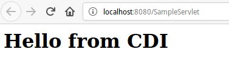
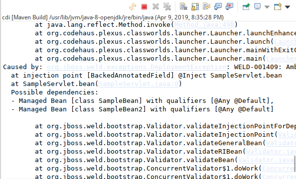
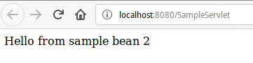
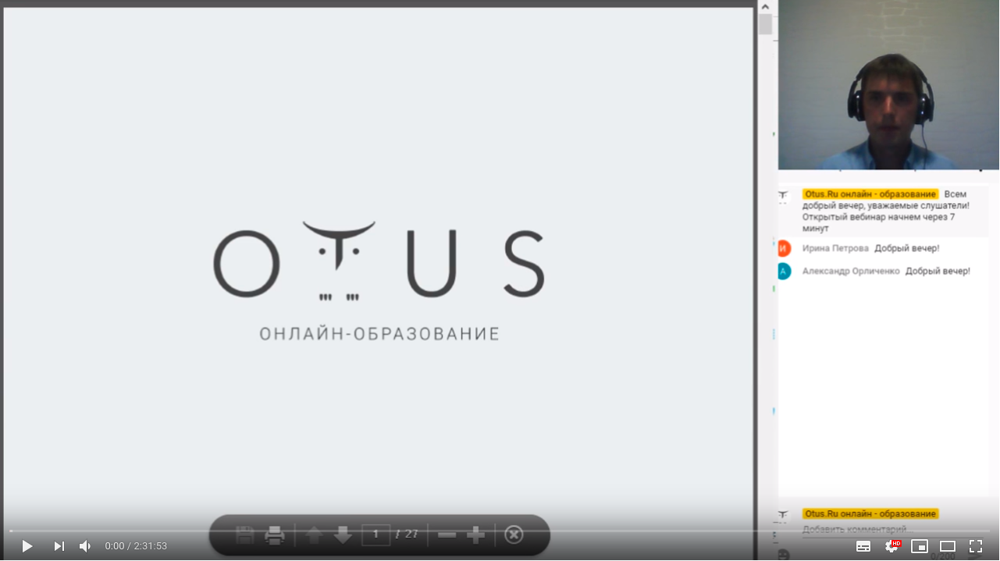

# CDI

# Зміст

${toc}

# Інверсія управління

**Інверсія управління** (англ. Inversion of Control, IoC) - важливий принцип об'єктно-орієнтованого програмування, що використовується для зменшення зачеплення в комп'ютерних програмах. Також архітектурне рішення інтеграції, що спрощує розширення можливостей системи, при якому потік управління програми контролюється фреймворком.

методи реалізації:
- Шаблон «Фабрика» (англ. Factory pattern)
- Локатор служб (Service Locator)
- Впровадження залежності (англ. Dependency injection)

# Що таке Dependency injection?

**Впровадження залежності** (англ. Dependency injection, DI) — шаблон проектування програмного забезпечення, що передбачає надання зовнішньої залежності програмному компоненту, використовуючи «інверсію управління» (англ. Inversion of control, IoC) для розв'язання (отримання) залежностей.

Впровадження — це передача залежності (тобто, сервісу) залежному об'єкту (тобто, клієнту). Передавати залежності клієнту замість дозволити клієнту створити сервіс є фундаментальною вимогою до цього шаблону проектування.

## Приклад

Уявіть собі, що ми проектуємо систему в, якій кожного місяця потрібно виводити статистику на екран(статистику продаж тощо).
Нехай цей об'єкт буди мати інтерфейс:

```java
public interface StatisticReporter {
	void report();
}
```

Все доволі просто, об'єкт буде мати один метод в інтерфейсі report(), який і виводить статистику на екран.

Користовуч може забажати мати статистику в різних форматах - HTML, XML, DOC. Для цих цілей ми введимо в системі інтерфейс:

```java
public interface Formatter {
	String format(String text);
}
```

І Зробимо декілька реалізації:

```java
public class HtmlFormatter implements Formatter {

	public String format(String text) {
		return "HTml format";
	}

}
```

```java
public class XMLFormatter implements Formatter {

	public String format(String text) {
		return "Xml format";
	}

}
```

І нерешті зробимо реалізацію StatisticReporter:

```java
public class StatisticReporterImpl implements StatisticReporter {
	
	HtmlFormatter formatter = new HtmlFormatter();
	
	public void report() {
		String report = "This is report";
		String outRep = formatter.format(report);
		System.out.print(outRep);
	}

}
```

Тестуємо систему:

```java
public class Main {
	
	public static void main(String[] args) {
		StatisticReporterImpl statisticReporterImpl = new StatisticReporterImpl();
		statisticReporterImpl.report();
	}
}
```

Якщо ми пішли таки шляхом, для того щоб виводити статистику в іншому форматы нам, або доведеться змінювати реалізацію 
statisticReporterImpl, або створювати ще один клас, який реалізує StatisticReporter.

Можна підти і іншим шляхом, замість того щоб створювати об'єкт Formatter всередині StatisticReporterImpl можна передати його ззовні:

```java
package test;

public class StatisticReporterImpl implements StatisticReporter {
	
	private Formatter formatter;
	
	public StatisticReporterImpl(Formatter formatter) {
		this.formatter = formatter;
	}
	
	public void report() {
		String report = "This is report";
		String outRep = formatter.format(report);
		System.out.print(outRep);
	}

}
```
```java
public class Main {
	
	public static void main(String[] args) {
		Formatter formatter = new HtmlFormatter();
		StatisticReporterImpl statisticReporterImpl = new StatisticReporterImpl(formatter);
		statisticReporterImpl.report();
	}
}
```

Тепер, для того щоб змінити формат статистики нам потрібно підставити одну із реалізації інтерфейсу Formatter.

# Що собою представляє CDI в Java?

CDI є стандартом Java для ін'єкцій залежностей (DI) і перехоплення (AOP).

CDI з'явився в Java EE 6, щоб забезпечити доступ до деяких доступних функцій EJB тільки для всіх компонентів, керованих контейнером. Таким чином, CDI bean охоплює сервлети, веб-службу SOAP, веб-службу RESTful, об'єкти, EJB і т.д.

# Weld, Jetty

Створіть новий maven-проект, використовуючи architype web-app.

Додайте залежність на сервлети, inhect, weld в pom.xml:

```xml
<properties>
    <jettyVersion>9.2.8.v20150217</jettyVersion>
    <weldVersion>2.2.9.Final</weldVersion>
    <servletVersion>3.1.0</servletVersion>
</properties>


<dependencies>
  <dependency>
    <groupId>javax.servlet</groupId>
    <artifactId>javax.servlet-api</artifactId>
    <version>${servletVersion}</version>
  </dependency>
  <dependency>
    <groupId>javax.inject</groupId>
    <artifactId>javax.inject</artifactId>
    <version>1</version>
  </dependency>
</dependencies>
```

Додайте maven-jetty-plugin в pom.xml:
```xml
<build>
    <plugins>
      <plugin>
        <groupId>org.eclipse.jetty</groupId>
        <artifactId>jetty-maven-plugin</artifactId>
        <version>${jettyVersion}</version>
	<dependencies>
          <dependency>
            <groupId>org.jboss.weld.servlet</groupId>
            <artifactId>weld-servlet</artifactId>
            <version>${weldVersion}</version>
            <type>jar</type>
          </dependency>
	</dependencies>
      </plugin>
    </plugins>
  </build>
```

Створіть beans.xml в директорії WEB-INF:
```xml
<beans xmlns="http://java.sun.com/xml/ns/javaee"
xmlns:xsi="http://www.w3.org/2001/XMLSchema-instance"
	xmlns:s="urn:java:ee"
	xmlns:in="urn:java:javax.inject"
	xsi:schemaLocation="http://java.sun.com/xml/ns/javaee http://java.sun.com/xml/ns/javaee/beans_1_0.xsd">

</beans>
```

Створіть jetty-env.xml в директорії WEB-INF:
```xml
<!DOCTYPE Configure PUBLIC "-//Mort Bay Consulting//DTD Configure//EN" "http://www.eclipse.org/jetty/configure.dtd">
<Configure id="webAppCtx" class="org.eclipse.jetty.webapp.WebAppContext">
    <New id="BeanManager" class="org.eclipse.jetty.plus.jndi.Resource">
        <Arg>
            <Ref id="webAppCtx"/>
        </Arg>
        <Arg>BeanManager</Arg>
        <Arg>
            <New class="javax.naming.Reference">
                <Arg>javax.enterprise.inject.spi.BeanManager</Arg>
                <Arg>org.jboss.weld.resources.ManagerObjectFactory</Arg>
                <Arg/>
            </New>
        </Arg>
    </New>
</Configure>
```

Додайте listener в web.xml:
```xml
 <listener>
    <listener-class>org.jboss.weld.environment.servlet.BeanManagerResourceBindingListener</listener-class>
  </listener>
  <listener>
    <listener-class>org.jboss.weld.environment.servlet.Listener</listener-class>
  </listener>


  ..... Конфігурація сервлетів.........

  <resource-env-ref>
        <resource-env-ref-name>BeanManager</resource-env-ref-name>
        <resource-env-ref-type>
            javax.enterprise.inject.spi.BeanManager
        </resource-env-ref-type>
   </resource-env-ref>
```

Створіть bean - SampleBean.java:
```java
public class SampleBean {
    public String getMessage() {
	return "<h1>Hello from CDI</h1>";
    }
}
```

Створіть сервлет - SampleServlet.java:
```java
public class SampleServlet extends HttpServlet
{
    @Inject SampleBean bean;
    protected void doGet(HttpServletRequest request, HttpServletResponse response) throws ServletException, IOException
    {
        response.setContentType("text/html");
        response.setStatus(HttpServletResponse.SC_OK);
        response.getWriter().println(bean.getMessage());
    }
}
```

Результат виконання застосунка:



# Default implementation

Створіть новий інтерфейс SampleBeanInterface:

```java
public interface SampleBeanInterface {
	String getMessage();
}
```

Модифікуйте SampleBean наступним чином:

```java
public class SampleBean implements SampleBeanInterface {
	public String getMessage() {
		return "<h1>Hello from CDI</h1>";
	}
}
```

Мидифікуйте SampleController наступним чином:

```java
import java.io.IOException;

import javax.inject.Inject;
import javax.servlet.ServletException;
import javax.servlet.http.HttpServlet;
import javax.servlet.http.HttpServletRequest;
import javax.servlet.http.HttpServletResponse;

public class SampleServlet extends HttpServlet {
	private static final long serialVersionUID = 1L;
       

	@Inject SampleBeanInterface bean;
	
    protected void doGet(HttpServletRequest request, HttpServletResponse response) throws ServletException, IOException
    {
        response.setContentType("text/html");
        response.setStatus(HttpServletResponse.SC_OK);
        response.getWriter().println(bean.getMessage());
    }

}
```

Можна побачити, що результат виконання нія не змінився:


Створіть новий клас SampleBean2:
```java
public class SampleBean2 implements SampleBeanInterface {

	public String getMessage() {
		return "Hello from sample bean 2";
	}

}
```

Після цього буде викликане виключення, тому що не зрозуміло яку залежність потрібно вибрати:



Модифікуйте SampleBean2:
```java
import javax.inject.Named;

@Named("bean2")
public class SampleBean2 implements SampleBeanInterface {

	public String getMessage() {
		return "Hello from sample bean 2";
	}

}
```

Модифікуте SampleBeanServlet:
```java
public class SampleServlet extends HttpServlet {
	private static final long serialVersionUID = 1L;
       

	@Inject @Named("bean2") SampleBeanInterface bean;
	
    protected void doGet(HttpServletRequest request, HttpServletResponse response) throws ServletException, IOException
    {
        response.setContentType("text/html");
        response.setStatus(HttpServletResponse.SC_OK);
        response.getWriter().println(bean.getMessage());
    }

}
```

Результат виконання застосунка:



Завантажити приклад:
- Репозиторій [java-ee-example](https://github.com/endlesskwazar/java-ee-examples)
- Гілка cdi-ex1

# Entity Manager

**EntityManager** є частиною Java Persistence API. В основному, він реалізує інтерфейси програмування та правила життєвого циклу, визначені специфікацією JPA 2.0.

Більш того, ми можемо отримати доступ до Persistance Context, використовуючи API в EntityManager.


# Bean validation API


# Домашня робота

Розробіть MVC додаток, використовуючи Servlets, JSP, JPA, Bean vaidation, CDI.

# Додаткові матеріали

## Открытый вебинар Java Enterprise "CDI in action"
[](https://www.youtube.com/watch?v=-kto09UEBNo&t=4424s&index=2&list=PLek9OG9m4BxpYC4Ds56KANEvXs0F9AuWi)


