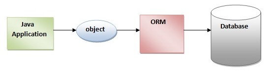
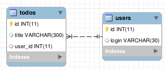

# Що таке JPA?

**JPA** (Java Persistence API) це специфікація Java EE і Java SE, що описує систему управління збереженням java об'єктів в таблиці реляційних баз даних в зручному вигляді. Сама Java не містить реалізації JPA, проте існує багато реалізацій даної специфікації від різних компаній (відкритих і немає). Це не єдиний спосіб збереження java об'єктів в бази даних (ORM систем), але один з найпопулярніших в Java світі.

Існує кілька реалізацій цього інтерфейсу, одна з найпопулярніших використовує для цього Hibernate. JPA реалізує концепцію ORM.

# ORM

В об'єктно-орієнтованому програмуванні об'єкти в програмі представляють об'єкти з реального світу. Як приклад можна розглянути адресну книгу, яка містить список людей разом з кількома телефонами і кількома адресами. В термінах об'єктно-орієнтованого програмування вони представлятимуться об'єктами класу «Людина», які міститимуть наступний список полів: ім'я, список (або масив) телефонів і список адрес.

Суть проблеми полягає в перетворенні таких об'єктів у форму, в якій вони можуть бути збережені у файлах або базах даних, і які легко можуть бути витягнуті в подальшому, зі збереженням властивостей об'єктів і відношень між ними. Ці об'єкти називають «постійними» (англ. persistent). Історично існує кілька підходів до рішення цієї задачі.

**ORM** (англ. Object-relational mapping, Об'єктно-реляційна проекція) — технологія програмування, яка зв'язує бази даних з концепціями об'єктно-орієнтованих мов програмування, створюючи «віртуальну об'єктну базу даних».



# Entity

**Entity** (Сутність) - POJO-клас, пов'язаний з БД за допомогою анотації (@Entity) або через XML. До такого класу ставляться такі вимоги:
- Повинен мати порожній конструктор (public або protected)
- Не може бути вкладеним, інтерфейсом або enum
- Не може бути final і не може містити final-полів / властивостей
- Повинен містити хоча б одне @id-поле

При цьому entity може:
- Містити непусті конструктори
- Успадковуватися і бути успадкованим
- Містити інші методи і реалізовувати інтерфейси

**POJO** (англ. Plain Old Java Object) - «старий добрий Java-об'єкт», простий Java-об'єкт, який не успадкований від якогось специфічного об'єкта і не реалізує жодних службових інтерфейсів окрім тих, які потрібні для бізнес-моделі.

# Hibernate

**Hibernate** — засіб відображення між об'єктами та реляційними структурами (object-relational mapping, ORM) для платформи Java. Hibernate є вільним програмним забезпеченням, яке поширюється на умовах GNU Lesser General Public License. Hibernate надає легкий для використання каркас (фреймворк) для відображення між об'єктно-орієнтованою моделлю даних і традиційною реляційною базою даних.

# Переваги Hibernate

- Hibernate усуває безліч спагетті коду (повторюваного), який постійно переслідує розробника при роботі з JDBC. Приховує від розробника безліч коду, необхідного для управління ресурсами і дозволяє зосередитися на бізнес логіці.
- Hibernate підтримує XML так само як і JPA анотації, що дозволяє зробити реалізацію коду незалежною.
- Hibernate надає власний потужний мову запитів (HQL), який схожий на SQL. Варто відзначити, що HQL повністю об'єктно-орієнтований і розуміє такі принципи, як успадкування, поліморфізм і асоціації (зв'язку).
- Hibernate - широко поширений open source проект. Завдяки цьому доступні тисячі відкритих статей, прикладів, а так само документації по використанню фреймворка.
- Hibernate легко інтегрується з іншими Java EE фреймворками, наприклад, Spring Framework підтримує вбудовану інтеграцію з Hibernate.
- Hibernate підтримує ледачу ініціалізацію використовуючи proxy об'єкти і виконує запити до бази даних тільки по необхідності.
- Hibernate підтримує різні рівні cache, а отже може підвищити продуктивність.
- Важливо, що Hibernate може використовувати чистий SQL, а значить підтримує можливість оптимізації запитів і роботи з будь-яким стороннім вендором БД і його фичами.

# Переваги Hibernate в порівнянні із JDBC

- Hibernate підтримує спадкування, асоціації та колекції, що не доступно в JDBC API.
- Hibernate неявно використовує управління транзакціями. Більшість запитів не можна виконати поза транзакції. При використанні JDBC API для управління транзакціями потрібно явно використовувати commit і rollback.
- JDBC API throws SQLException, яке відноситься до перевіряється винятків, а значить необхідно постійно писати безліч блоків try-catch. У більшості випадків це не потрібно для кожного виклику JDBC і використовується для управління транзакціями. Hibernate обертає виключення JDBC через непроверяемие JDBCException або HibernateException, а значить немає необхідності перевіряти їх в коді кожен раз. Вбудована підтримка управління транзакціями в Hibernate прибирає блоки try-catch.
- Hibernate Query Language (HQL) більш об'єктно орієнтований і близький до Java мова запитів, ніж SQL в JDBC.
- Hibernate підтримує анотації JPA, а значить код є стерпним на інші ORM фреймворки, що реалізують стандарт, в той час як код JDBC сильно прив'язаний до додатка.

# Конфігурація Hibernate

## XML

## Annotation

## Java, Fluent API

# Основні класи Hibernate

# Реалізація патерна DAO, використовуючи Hibernate

## База даних

Скрипт бази даних, яка буде використовуватися в прикладі:

```sql
create database jpatest;
use jpatest;

create table users(
id integer primary key auto_increment,
login varchar(30) unique
);

create table todos(
id integer primary key auto_increment,
title varchar(300),
user_id integer,
foreign key(user_id) references users(id) on delete cascade on update cascade
);
```




## Створення проекту

## Створення сутності

## Налаштування з'єднання

## Реалізація патерна DAO

## Демонстрація роботи

## Створення зв'язку один - до - багатьох

## Демонмтрація роботи

## Фінальний проект

# Домашня робота

## Варіанти

# Контрольні запитання
