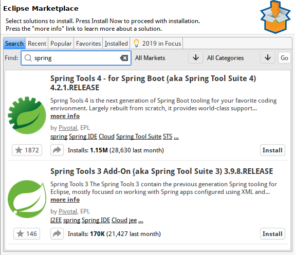

# Spring Framework. Spring Core. Spring Boot. Spring MVC

# Зміст

${toc}

# Spring Framework

Spring Framework складається з функцій, організованих у близько 20 модулів. Ці модулі згруповані в Core Container, Data Access/Integration, Web, AOP (Aspect Oriented Programming), Tests як показано на наступній схемі.

## Core Container

Core Container складається з модулів Core, Beans, Context і Language Expression.

**Core та Beans** складають фундамент Spring, включаючи особливості IoC та Dependency Injection. BeanFactory являє собою складну реалізацію Factory Pattern. Це усуває потребу в програмних синглетонах і дозволяє відділити конфігурацію і специфікацію залежностей від фактичної логіки програми.

Модуль **Context** будується на твердій основі, що надається модулями Core і Beans: це засіб доступу до об'єктів у стилі, що відповідає фреймворку, подібним до реєстру JNDI. Модуль Context успадковує його функції від модуля Beans і додає підтримку інтернаціоналізації (використовуючи, наприклад, пакети ресурсів), поширення подій, завантаження ресурсів і прозоре створення контекстів, наприклад, контейнером сервлетів. Модуль Context також підтримує функції Java EE, такі як EJB, JMX і базові віддалені можливості. Інтерфейс ApplicationContext є фокусною точкою модуля Context.

Модуль **Expression Language** надає потужну мову виразів для запитів і маніпулювання графом об'єктів під час виконання. Це розширення уніфікованої мови виразів (уніфікованого EL), як зазначено в специфікації JSP 2.1. Мова підтримує налаштування і отримання значень властивостей, призначення властивостей, виклику методів, доступу до контексту масивів, колекцій і індексаторів, логічних і арифметичних операторів, іменних змінних і вилучення об'єктів за назвою з контейнера IoC Spring. Він також підтримує проекцію і вибір списку, а також загальні агрегації списків.

## Data Access/Integration

Рівень доступу до даних / інтеграції складається з модулів JDBC, ORM, OXM, JMS і Transaction.

Модуль **JDBC** забезпечує рівень абстракції JDBC, який усуває необхідність виконувати стомлююче кодування JDBC і синтаксичний аналіз специфічних кодів помилок бази даних-постачальників.

Модуль **ORM** забезпечує інтеграційні шари для популярних API-об'єктів-реляційних відображень, включаючи JPA, JDO, Hibernate і iBatis. Використовуючи пакет ORM, ви можете використовувати всі ці рамки O / R-відображення у поєднанні з усіма іншими функціями, які пропонує весна, наприклад, просту декларативну функцію управління транзакціями, згадану раніше.

Модуль **OXM** забезпечує шар абстракції, який підтримує реалізації об'єктів / XML-відображень для JAXB, Castor, XMLBeans, JiBX і XStream.

Модуль **Java Messaging Service (JMS)** містить функції для створення та споживання повідомлень.

## WEB

Веб-рівень складається з модулів Web, Web-сервлет, Web-Struts і Web-Portlets.

Веб-модуль Spring надає основні веб-орієнтовані функції інтеграції, такі як функціональність завантаження багатофазних файлів і ініціалізація контейнера IoC з використанням сервлетів і веб-орієнтованого контексту програми. Він також містить розділи, пов'язані з веб-посиланням, на підтримку віддаленого доступу до весни.

Модуль Web-Servlet містить реалізацію Spring-Model-View-Controler (MVC) для веб-додатків. MVC-платформа Spring забезпечує чітке розмежування між кодом доменної моделі та веб-формами та інтегрується з усіма іншими функціями Spring Framework.

Модуль Web-Struts містить класи підтримки для інтеграції класичного веб-рівня Struts у програмі Spring. Зверніть увагу, що ця підтримка тепер застаріла з весни 3.0. Розгляньте можливість перенесення вашої програми на Struts 2.0 та її інтеграцію Spring або на рішення MVC Spring.

Модуль Web-Portlet забезпечує реалізацію MVC для використання в середовищі портлетів і відображає функціональність модуля Web-Servlet.

## AOP

Модуль AOP надає AOP Альянс-сумісний аспектно-орієнтоване програмування, що дозволяє визначити, наприклад, методів перехоплювачів і pointcuts для чистого роз'єднання коду, який реалізує функціональність, яка повинна бути розділена. Використовуючи функціональність метаданих на початковому рівні, ви також можете вбудовувати поведінкову інформацію у свій код, подібно до того, як атрибути .NET.

## Test

Модуль Тест підтримує тестування компонентів Пружини за допомогою JUnit або TestNG. Він забезпечує послідовне завантаження Spring ApplicationContexts і кешування цих контекстів. Він також надає макетні об'єкти, які можна використовувати для тестування коду окремо.

# Spring Core

### Ініціалізація ApplicationContext і отримання beans

**project**: context-xml-conf

### Dependency Injection using xml configuration

**project**: di-xml-conf

### Configuration via Java

**project**: context-java-conf

### Component Scan

**project**: componentscan

### spring DI annotation

**project**: autowire-example

### spring qualifier

**project**: autowire-qualifier-example

# Spring boot

Spring Boot - це платформа для упаковки додатки Spring з розумними значеннями за замовчуванням. Що це означає?. Ви розробляєте веб-додаток, використовуючи Spring MVC, Spring Data, Hibernate і Tomcat. Як ви розміщуєте і розгортаєте це додаток на своєму веб-сервері. На даний момент ми повинні вручну писати конфігурації, файли XML і т.д. Для розгортання на веб-сервері.

Spring Boot зробить це для вас з нульовою налаштуванням XML в вашому проекті. Spring Boot - чарівна структура, яка пов'язує всі залежності для вас. Нарешті, ваш веб-додаток буде автономним JAR файлом з вбудованим сервером.

**Установка плагіна для Eclipse**:

1. Відкрийте Eclipse Marketplace: Help -> Eclipse Marketplace

2. В пошуковому рядку введіть spring

3. Натисніть Install

4. В наступному вікні натисніть Confirm

5. Прийміть ліцензію і натисніть Finish

6. Дочекайтеся кінця установки і перезапустіть Eclipse

**Створення нового проекта**:

1. Тепер серед темплейтів, при створені нового проекту можна знайти Spring Starter Project

2. Spring Boot дозволяє вибрати систему сборки, мову, і додаткові налаштування проекту

3. Також є можливість вибрати залежності, які потрібно включити в проект

# Spring WEB

У Spring запит HTTP обробляється контролером. Ці запити можна легко визначити за допомогою анотації @Controller.

**project**: spring-web

# Spring DATA & TODO APP example

**project**: spring-todo

